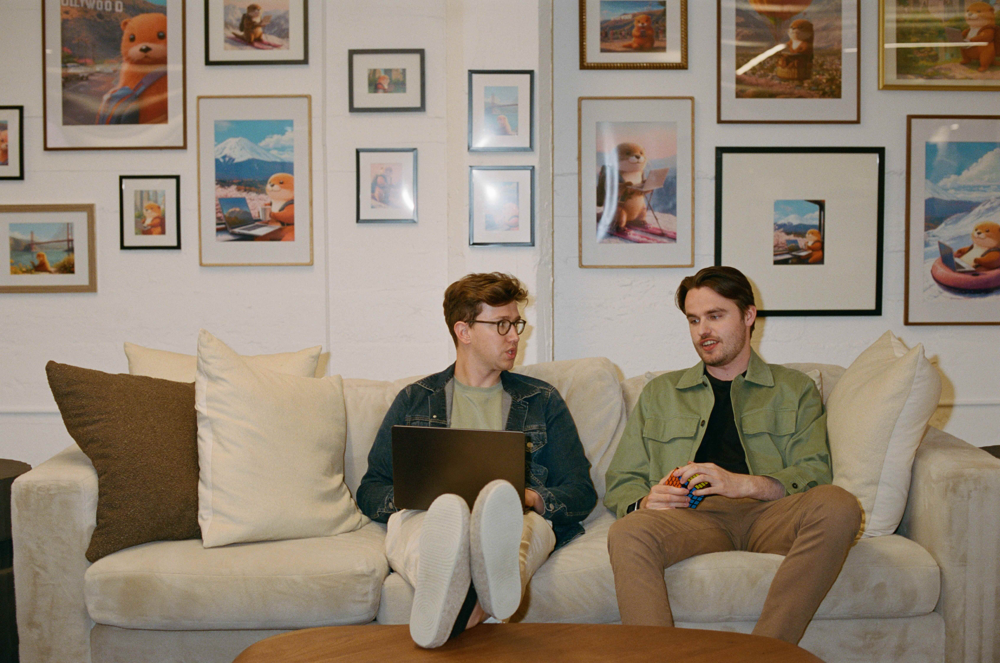

# 在前沿工作：Cognition 如何放心让 Claude Fable 5 通宵工作（中英对照）

> **原文标题：** Working at the frontier: How Cognition trusts Claude Fable 5 to work through the night
> **作者：** Anthropic（原文未署名）
> **原文链接：** https://claude.com/blog/working-at-the-frontier-how-cognition-trusts-claude-fable-5-to-work-through-the-night
> **发布日期：** 2026-07-10
> **翻译模型：** GLM-5.3
> 排版：每段英文原文在前，中文翻译紧随其后。术语保留英文原文并附中文释义。

---

Cognition tested Claude Fable 5 in Devin, its AI software engineer. It's the first model its team trusts to run unattended for eight hours and deliver production-ready code.

Cognition 在其 AI 软件工程师 Devin 中测试了 Claude Fable 5。这是他们的团队第一个敢放手让其无人值守运行八小时并交付生产级代码的模型。

Silas Alberti, SVP of Research at Cognition, has tested nearly every Claude model inside Devin, the company's AI software engineer. Claude Fable 5 is the first he'd trust to leave running overnight.

Silas Alberti 是 Cognition 的研究高级副总裁（SVP of Research），在公司旗下的 AI 软件工程师 Devin 里测试过几乎每一代 Claude 模型。Claude Fable 5 是第一个让他放心让其通宵运行的模型。

Cognition is young, even by Silicon Valley standards. It built Devin, its autonomous AI software engineer, in early 2024, at a time when the basic mechanics of an agent barely held together.

即使按硅谷的标准，Cognition 也算年轻的。它在 2024 年初构建了自己的自主 AI 软件工程师 Devin，而那时智能体的基本运行机制还只是勉强拼凑在一起。

Devin takes on the work engineers never quite get to: codebase migrations, the backlog of bugs, the features that keep slipping. With customers ranging from high-growth startups to Fortune 500 companies, the bar is high. Code written by Devin has to be reliable and production-ready; a small bug introduced quietly can cause real problems downstream.

Devin 承担的是工程师们一直顾不上的工作：代码库迁移、积压的缺陷、一再延期的功能。客户从高增长初创公司到财富 500 强企业不等，标准自然很高。Devin 写出的代码必须可靠、可直接用于生产；一个悄悄混入的小缺陷可能在下游引发真正的麻烦。

Alberti's team trains and tests the models behind Devin and has run nearly every Claude generation since the start. He traces the first real jump to Claude 3.6 Sonnet in late 2024. It was the first model that could reliably chain tools and hold a multi-step task. When the team plugged it into Devin, internal usage tripled.

Alberti 的团队负责训练和测试 Devin 背后的模型，从最初至今几乎跑遍了每一代 Claude。他认为第一次真正的跃升要归功于 2024 年末的 Claude 3.6 Sonnet。那是第一个能够可靠地串联工具、稳住多步骤任务的模型。团队把它接入 Devin 后，内部使用量增长到了原来的三倍。

That history is what makes him hard to impress. Cognition has watched models ace a benchmark and then fall apart the moment its engineers tried to use them. "We've been burned like this a bunch of times," Alberti says. So the team trusts its own engineers over any score. Its highest-taste developers put each new model through a real day of work, and the bar is whether the code is something they'd actually keep.

正是这段经历让他很难被打动。Cognition 见过模型在基准测试中拿高分，却在自家工程师上手使用的那一刻崩溃。"我们被这样坑过很多次了，"Alberti 说。所以，团队更相信自己的工程师而不是任何分数。品味最高的开发者会让每个新模型干满一天真实的工作，标准就是那些代码是否真的会被他们留下来。

As Alberti puts it, "we trust no eval."

用 Alberti 的话说："我们不信任任何 eval（评估）。"

# 早期模型触顶之处（Where earlier models hit their limit）

For all that progress, one ceiling remained: how long an agent could run before it lost the thread?

尽管进步巨大，一个天花板依然存在：一个智能体在迷失方向之前到底能运行多久？

"Before Fable, you could delegate agents that could stay on-task for a couple of minutes, maybe an hour," Alberti says. After that, sessions drifted. Give an earlier model five ideas to weigh at once, and it would lose track and get confused. On one database migration, a prior Opus model technically finished the job but introduced a series of subtle bugs along the way.

"在 Fable 之前，你能派出去的智能体最多保持几分钟、也许一个小时的专注，"Alberti 说。超过这个时限，会话就开始漂移。给早期模型五个需要同时权衡的想法，它就会跟丢并陷入混乱。在一次数据库迁移中，上一代 Opus 模型名义上完成了任务，却在过程中引入了一连串隐蔽的缺陷。

Incident triage showed the same shape. Earlier models tended to stay at the surface of the logs instead of digging for the relevant line, and they were trained to give an answer no matter what—so they'd "confidently claim the first plausible thing they discover and then stop." Engineers learned to tune them out.

事件分诊（incident triage）表现出同样的形态。早期模型往往停留在日志表面，而不去挖掘相关的那一行，而且它们被训练成无论如何都要给出答案--于是它们会"笃定地宣称自己发现的第一种说得通的解释，然后就停下"。工程师们学会了对此自动屏蔽。

> Cognition evaluates frontier models against a series of benchmarks, including Frontier Code.
> Cognition 用一系列基准测试评估前沿模型，其中包括 Frontier Code。

# Claude Fable 5 达到 Cognition 自己的标准（Claude Fable 5 clears Cognition's own bar）

Cognition grades models on Frontier Code, a benchmark it built because existing ones kept rewarding code that passed tests but wouldn't survive a real codebase. Alberti calls it an "anti-slop" standard. On its hardest subset, the prior Opus model scored around 10%. Claude Fable 5 scored about 30%.

Cognition 用 Frontier Code 给模型打分，这个基准测试是它自己构建的，因为现有的基准总是奖励那些能通过测试却无法在真实代码库中存活的代码。Alberti 称之为"anti-slop"（反劣质代码）标准。在最难的子集上，上一代 Opus 模型得分约为 10%。Claude Fable 5 拿下了约 30%。

The team's first reaction was suspicion. "Is there a bug? This can't be true." Usually a benchmark jump comes with engineers arguing for weeks over whether the model is actually better in practice. This time the dogfooding agreed with the numbers. "It was kind of a shocker, honestly," Alberti says.

团队的第一反应是怀疑。"是不是有 bug？这不可能是真的。"通常基准分数的跃升会伴随着工程师们长达数周的争论，争辩模型在实际使用中是否真的更好。这一次，内部亲测（dogfooding）的结果与数字吻合。"说实话，这挺让人震惊的，"Alberti 说。

"The biggest thing we noticed was the horizon, how long it can be self-sufficient," he says. "There have been tasks where I was about to go to bed and I was like, 'Okay, just please keep working on this and don't stop until I wake up.' And then I wake up, and it's been working for eight hours straight and actually making real progress. I hadn't seen that before."

"我们注意到的最大不同是它的时间视野（horizon），也就是它能自我维持多久，"他说，"有过这样的任务：我准备上床睡觉时跟它说，'好，请继续做这个，我醒来之前别停。'然后我一觉醒来，它已经连续干了八个小时，而且确实在取得真正的进展。这种事我以前从没见过。"

The horizon held because Claude Fable 5 stayed clear-headed in messy context. It was the first model to properly use Cognition's internal debugging tools, paging through logs in the browser and drawing conclusions despite the noise. On a migration that had tripped up earlier models, it stated the invariants it would hold itself to, then executed against them. On triage, it pinned down the root cause and said what it didn't know, which Alberti says is what actually rebuilds trust.

这个时间视野之所以守得住，是因为 Claude Fable 5 在杂乱的上下文中依然保持清醒。它是第一个能正确使用 Cognition 内部调试工具的模型--在浏览器中翻阅日志，并在噪声中得出结论。在一次曾让早期模型栽跟头的迁移任务中，它先声明了自己要遵守的不变量（invariants），然后照此执行。在分诊任务上，它锁定了根因，并且会说明自己不知道什么--Alberti 说，这才是真正能重建信任的东西。

He puts the jump in a small class of true step changes, the kind that come roughly once a year.

他把这次跃升归入极少数真正的阶梯式变革（step change），那种大约一年才出现一次的变革。

> Silas and his team are building Devin, powered by models like Claude, to tackle more complex, longer running workloads.
> Silas 和他的团队正在构建由 Claude 等模型驱动的 Devin，以应对更复杂、运行时间更长的工作负载。

# 下一步（What's next）

Cognition's founding bet was that agents should run in the cloud for hours at a time. For the company's first year, the models weren't there yet.

Cognition 创立时的押注是：智能体应当一次能在云端运行数小时。在公司成立的第一年，模型还达不到这个水平。

Alberti says Claude Fable 5 makes the full version of that bet viable, and some of it is already in the product. Devin can watch a Slack channel and jump into an issue without being tagged, or monitor production and triage a spike on its own. When it gets one of those right, he says, it feels "like a real engineer on the team."

Alberti 说，Claude Fable 5 让这一押注的完整版本变得可行，其中一部分已经进入产品。Devin 可以监听某个 Slack 频道，在没有被 @ 的情况下主动介入一个 issue；也可以监控生产环境、自行分诊一次流量激增。他说，当它做对其中一件事时，感觉"就像团队里一位真正的工程师"。

He expects this to become the default for engineering teams. In a year or two, he says, 90% of agent sessions will be proactive ones that find a problem, scan the codebase, and message you with the fix.

他预计这将成为工程团队的默认状态。他说，一两年内，90% 的智能体会话都将是主动式的：发现问题、扫描代码库，然后把修复方案发给你。

"A lot of these things we've always wanted to build at the company are now possible," Alberti says.

"公司里很多我们一直想做的东西，现在都成为可能了，"Alberti 说。

Get started with Claude Fable 5.

开始使用 Claude Fable 5。
