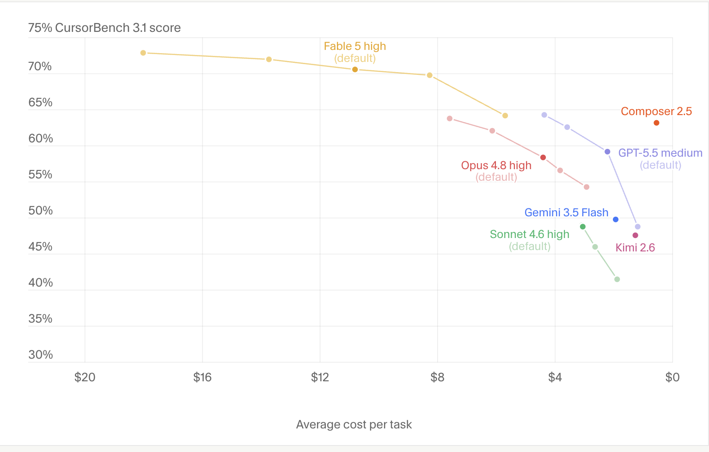

# 在前沿工作：Cursor 如何确信 Claude Fable 5 已准备好应对最难的 1% 的问题（中英对照）

> **原文标题：** Working at the frontier: How Cursor knew Claude Fable 5 was ready for the hardest 1% of problems
> **作者：** Anthropic（原文未署名）
> **原文链接：** https://claude.com/blog/working-at-the-frontier-cursor
> **发布日期：** 2026-07-17
> **翻译模型：** GLM-5.3
> 排版：每段英文原文在前，中文翻译紧随其后。术语保留英文原文并附中文释义。

---

How Anthropic's Claude Fable 5 beat CursorBench and expanded what's possible for Cursor and agentic coding.

Anthropic 的 Claude Fable 5 如何在 CursorBench 基准测试中胜出，并拓展了 Cursor 与智能体编码的可能性边界。

Nate Schmidt's job at Cursor is to evaluate frontier models against their ability to tackle long-running, real-world engineering problems. Here's why–and how–Claude Fable 5 changed the calculus on what coding agents are capable of.

Nate Schmidt 在 Cursor 的职责，是评估前沿模型（frontier models）解决长时间运行的真实工程问题的能力。本文讲述 Claude Fable 5 为何、以及如何改变了人们对编码智能体（coding agents）能力上限的判断。

Cursor is an AI coding agent for building professional software. It supports every major frontier model alongside Cursor's own, which makes the company an unusually neutral judge of how each one actually performs.

Cursor 是一款用于构建专业软件的 AI 编码智能体。除自研模型外，它还支持所有主流前沿模型，这让 Cursor 成了一个罕见的中立裁判，可以评判各家模型的真实表现。

Nate Schmidt is the engineer who maintains that scorecard. He works on evals and model behavior at Cursor: studying how models succeed, how they fail, and what makes a developer quietly switch away from one mid-task. When colleagues and customers want a read on a new release, they come to him.

Nate Schmidt 就是维护这份"成绩单"的工程师。他在 Cursor 从事 evals（模型评估）与模型行为研究：研究模型如何成功、如何失败，以及是什么让开发者在任务中途悄悄弃用某个模型。每当同事和客户想了解某个新发布的水平，都会来找他。

Over time, Schmidt's team noticed that public benchmark scores and real developer reception to these models had stopped lining up, so they built their own: CursorBench.

久而久之，Schmidt 的团队注意到，公开基准测试的分数与开发者对这些模型的真实反响已经对不上号，于是他们构建了自己的基准测试：CursorBench。

CursorBench was built to capture the messy, underspecified ways engineers actually prompt their models. One eval task is just a stack trace pasted in with the single word "fix," and the model has to infer the intent, find the root cause, and validate the change on its own. Another tells the model the wrong module is broken, to see whether it challenges the user's assumption or follows it into a dead end.

CursorBench 的设计初衷，是捕捉工程师实际向模型提问时那种凌乱、欠明确（underspecified）的方式。有一个评估任务只是粘贴一段堆栈跟踪（stack trace）外加一个词"fix"（修复），模型必须自行推断意图、找到根因并验证改动。另一个任务则告诉模型错误的模块出了问题，以此观察它会质疑用户的假设，还是顺着这个假设走进死胡同。

When Claude Fable 5 ran the eval, the model achieved 72.9% at Max effort, setting a new high, and capturing what agentic coding tools were capable of when paired with the right models.

当 Claude Fable 5 运行这项评估时，该模型在 Max 效力档位下取得了 72.9% 的成绩，创下新高，也展现出智能体编码工具与合适的模型搭配时的真实能力上限。

> Claude Fable 5 achieved achieved 72.9% at Max effort, setting a new high.
> Claude Fable 5 在 Max 效力档位下取得 72.9% 的成绩，创下新高。

But when Schmidt was using the model on his own engineering workflows and personal tests, he'd stopped having to repeat his goals. The constant babysitting—reminding the model of context, spelling out the solution, auditing the results—wasn't necessary anymore. He could hand over a problem, from the gnarly refactor he was putting off to reasoning about nuanced edge cases, and Claude Fable 5 could solve it.

而当 Schmidt 在自己的工程工作流和个人测试中使用这个模型时，他不再需要反复重申自己的目标。那种不停"盯梢照看"的日子--提醒模型上下文、把解决方案一步步说清楚、审计结果--都不再必要了。无论是他一直拖着没做的棘手重构，还是对细微边界情况的推理，他都可以把问题直接交给 Claude Fable 5，而它能解决。

"I don't feel like I have to bootstrap Claude Fable 5 to understand the world I exist in and the problem I'm trying to solve," Schmidt says. "The model just has a sense of it out-of-the-box."

"我觉得我不需要再引导（bootstrap）Claude Fable 5 去理解我所处的世界和我要解决的问题，"Schmidt 说，"这个模型开箱即用就有这种感知。"

## 对整个任务的全局推理（Reasoning about the entire mission）

When Schmidt's team runs a new model through CursorBench, the right answer is table stakes. What they're scoring is whether the model understood what it was being asked.

当 Schmidt 的团队用 CursorBench 测试一个新模型时，答对只是基本要求（table stakes）。他们真正打分的，是模型是否理解了自己被要求做什么。

"Many evals look like this: here's a well-defined problem, here are the constraints, go fix it. But the prompts we get from real users don't really look like that," Schmidt says. "The model has to infer that the user has a problem and what they're trying to convey, identify the root cause, fix it, validate the fix, and report back."

"很多评估是这样的：这是一个定义明确的问题，这些是约束条件，去修吧。但真实用户发来的提示词并不是那个样子，"Schmidt 说，"模型必须推断出用户遇到了什么问题、想表达什么，找出根因，修复它，验证修复，然后汇报。"

Claude Fable 5 scored so well on these ambiguous tasks, the Cursor team started to feel suspicious.

Claude Fable 5 在这些模糊任务上的得分高到让 Cursor 团队开始起疑。

"One of two things is happening: either the model's very smart, or the model is cheating," he says. So the team looked into the traces, reading the model's actual reasoning on the hardest tasks, the ones where the prompt looks simple but cracking it requires understanding the whole system.

"只可能有两种情况：要么这个模型非常聪明，要么它在作弊，"他说。于是团队深入检查了 trace（模型执行轨迹），阅读模型在最难任务上的真实推理过程--那些任务提示词看起来简单，但要攻克它需要理解整个系统。

"We just kept seeing the model dig out wins that no other model was doing previously," he says. It was also getting there with fewer operations: token-efficient relative to the work it completed.

"我们不断看到这个模型挖出此前其他模型从未拿下的成果，"他说。而且它用更少的操作就达到了目的：相对于完成的工作量而言，它的 token 消耗很省。

Then Schmidt put Claude Fable 5 on one of his favorite personal tests: landing on the moon.

随后，Schmidt 让 Claude Fable 5 做了一个他最喜欢的个人测试：登月。

A few weeks earlier he'd wired Claude Opus into a programmable space-flight simulator with a one-line prompt—build a rocket and land it on the moon—and let it run on a second monitor for twelve to sixteen hours. The model would launch, run out of fuel in orbit, add a lot more fuel, then fail to clear the atmosphere because the rocket was now too heavy.

几周前，他曾用一行提示词把 Claude Opus 接入一个可编程的太空飞行模拟器--"造一枚火箭并让它登陆月球"--然后让它在第二块显示器上跑了十二到十六个小时。这个模型陷入的循环是：发射、在轨道上耗尽燃料、加装大量燃料，然后因为火箭变得太重而无法冲出大气层。

He re-ran the experiment with the same blank-slate prompt, this time using Claude Fable 5. A few minutes in, the rocket went up, parked in low orbit, and came back down. Same failure as before. Then Schmidt read the transcript.

他用同样的"白纸"提示词重新运行了这个实验，这次用的是 Claude Fable 5。几分钟后，火箭升空、停泊在近地轨道，然后又落回了地面。和之前的失败一模一样。接着，Schmidt 阅读了运行记录。

"Fable decided it wouldn't go to the moon on its first attempt. It wanted to do an initial mission just to go into orbit and collect telemetry, then use that to inform the next trip." A few attempts later, the engine noise on his second monitor stopped. There was a lander on the moon. The whole run took a couple of hours, against Opus's twelve-plus with no result.

"Fable 决定不在第一次尝试就直接飞向月球。它想先执行一个只进入轨道并收集遥测数据的初始任务，再用这些数据指导下一次飞行。"几次尝试之后，他第二块显示器上的引擎噪音停了。月球上出现了一个着陆器。整次运行只用了几个小时，而 Opus 跑了十二个小时以上仍一无所获。

"With Opus, it was doing local reasoning—thinking about what just happened and what's immediately about to happen," Schmidt says. "With Fable it's global reasoning. It's thinking about the entire mission."

"用 Opus 时，它做的是局部推理--想的是刚刚发生了什么、马上要发生什么，"Schmidt 说，"而 Fable 做的是全局推理。它思考的是整个任务。"

> Cursor runs all models through CursorBench, their internal benchmark for evaluating models on tasks that simulate real developer work.
> Cursor 让所有模型都通过 CursorBench 跑一遍，这是他们用于在模拟真实开发者工作的任务上评估模型的内部基准测试。

## 何时该追求全局最优（When to reach for the global optimum）

Schmidt has settled on a simple rule for when to use Claude Fable 5 over cheaper, less intelligent models.

对于什么时候该用 Claude Fable 5 而不是更便宜、更弱的模型，Schmidt 已经形成了一条简单的经验法则。

"If you have a good sense of what the path from A to B looks like, you might not need Fable. If you're at A and you have no idea where B is, Fable is an excellent choice," he says. "When I want to build something the right way, Fable is the first model I think of."

"如果你很清楚从 A 到 B 的路径长什么样，你可能不需要 Fable。如果你在 A 点，却完全不知道 B 在哪里，Fable 是极佳的选择，"他说，"当我想以正确的方式构建某样东西时，Fable 是我第一个想到的模型。"

Claude Fable 5 has also allowed his team to focus on projects the team had previously shelved—rewrites everyone agreed would be better but nobody could justify spending weeks on—because the model can carry enough of the skeleton. "It lowers the activation energy to work on these types of tasks," Schmidt says. "It lets us move in search of a global optimum rather than a local one."

Claude Fable 5 还让他的团队得以专注于此前束之高阁的项目--那些所有人都承认重写会更好、但没人能证明值得花上几周的重构--因为这个模型能扛起足够多的骨架工作。"它降低了处理这类任务的激活能（activation energy），"Schmidt 说，"它让我们得以朝着全局最优而非局部优先进发。"

It also changes how the team coordinates. Cursor runs lean, with intense individual ownership and few standups. Now, before touching shared code, Schmidt has an agent read his teammate's recent commits and flag conflicts, so neither of them has to stop what they're doing to check in.

这也改变了团队的协作方式。Cursor 的组织很精简，强调高度的个人负责制，站会（standup）很少。现在，在改动共享代码之前，Schmidt 会先让一个智能体阅读队友最近的提交并标记冲突，这样两个人都不必停下手中的工作去同步进展。

To balance cost and performance, his team pairs Claude Fable 5 with faster, lighter models for routine work and brings it in for the problems where capability is the constraint. In that configuration, he says, the combination is the most effective setup they've run.

为了在成本与性能之间取得平衡，他的团队让 Claude Fable 5 与更快速、更轻量的模型搭配处理日常工作，只在能力成为瓶颈的问题上才请它出马。他说，在这种配置下，这套组合是他们运行过的最有效的方案。

"If I'm getting into a really gnarly problem–the p99 of problems–the thing I'm trying to optimize for is time to solution," he says. "And I think Fable is the best model for solving our hardest problems."

"如果我要处理一个真正棘手的问题--问题中的 p99（最极端的百分位）--那我要优化的目标就是得出解决方案的时间，"他说，"而我认为 Fable 是解决我们最难问题的最佳模型。"

> Nate Schmidt tests new models across various evaluations, including putting it through the paces in a space-flight simulator.
> Nate Schmidt 会通过各种评估测试新模型，包括在太空飞行模拟器中让它大显身手。

## 下一步（What's next）

Despite putting the model through its paces on CursorBench and sending it to the moon, Schmidt is still looking for Claude Fable 5's limits. Next, he wants to see how long the model can manage a back-end system unattended; days-to-weeks runs are his next experiment. Inside Cursor, the team is using the model to hunt performance bottlenecks and user pain points proactively rather than waiting for reports, and to build the more sophisticated, closer-to-reality eval environments that will measure whatever comes next.

尽管已经在 CursorBench 上让这个模型经受了考验、还把它送上了月球，Schmidt 仍在寻找 Claude Fable 5 的极限。接下来，他想看看这个模型能在无人值守的情况下管理一个后端系统多久；以天到周为单位的运行是他的下一个实验。在 Cursor 内部，团队正在用这个模型主动搜寻性能瓶颈和用户痛点，而不是被动等待报告，并用它构建更复杂、更贴近现实的评估环境，以度量接下来的发展。

"There's a class of problems people weren't even thinking about because it didn't seem approachable," he says. "With Fable, I'm excited to push at that."

"有一类问题人们过去甚至从未想过，因为它们看起来无从下手，"他说，"有了 Fable，我很想在这些问题上发力。"

Get started with Claude Fable.

开始使用 Claude Fable。
