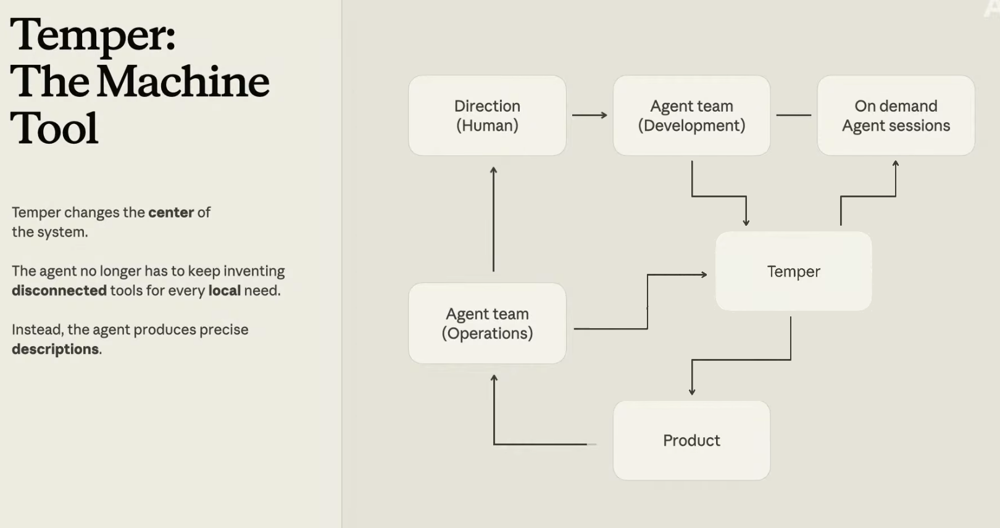

# Datadog 如何为 Claude Code 打造一台“万能机床”（中英对照）

> **原文标题：** How Datadog built a “universal machine tool” for Claude Code
> **作者：** Anthropic（原文未署名）
> **原文链接：** https://claude.com/blog/how-datadog-built-a-universal-machine-tool-for-claude-code
> **发布日期：** 2026-07-21
> **翻译模型：** GLM-5.3
> 排版：每段英文原文在前，中文翻译紧随其后。术语保留英文原文并附中文释义。

---

Datadog has an agent write specifications for a deterministic kernel to write application code

Datadog 让 agent 编写规格说明（specification），再由一个确定性内核（deterministic kernel）来编写应用代码。

Agents, mechanization, and industrialization

Agent、机械化与工业化。

All of Datadog engineers use AI coding tools for production code, and Claude Code drives at least two-thirds of that. With Claude Code, they generate personalized flows in their software development lifecycle in four distinct categories:

Datadog 的全体工程师都在使用 AI 编码工具编写生产代码，其中至少三分之二由 Claude Code 驱动。借助 Claude Code，他们在软件开发生命周期（SDLC）中生成个性化流程，覆盖四类不同场景：

- Targeted changes: dozens of gnarly bug fixes, performance optimizations, and bridges to existing services.
- Large refactors: refactoring a custom protobuf parser in three days as well as rewriting a metrics control from FoundationDB to Postgres in under three months.
- Replacing large parts: new sharding algorithms and autoscaling redesigns.
- Building entire systems: replacing MongoDB with Postgres, BYOC control planes, and ingestion pipelines from scratch.

- 定向改动：数十个棘手的 bug 修复、性能优化，以及与现有服务的桥接。
- 大型重构：三天内重构一个自定义 protobuf 解析器，以及在不到三个月内把一个指标控制层从 FoundationDB 重写为 Postgres。
- 替换大型部件：新的分片（sharding）算法与自动扩缩容的重新设计。
- 构建整个系统：用 Postgres 替换 MongoDB、构建 BYOC（bring-your-own-cloud，客户自带云）控制平面，以及从零构建数据摄取管线。

As work flowed across this map, however, they saw it became more complex to generate on one axis and more ambiguous to verify on the other.

然而，随着工作在这张版图上铺开，他们发现：沿一条轴线，生成变得越来越复杂；沿另一条轴线，验证变得越来越模糊。

# 心流问题（The flow problem）

For engineers, flow used to mean a direct relationship between intent and code. You understood the problem, wrote the code, tested it, reviewed it, shipped it, operated it, repeated. With agents, the abstraction is changing rapidly.

对工程师而言，心流（flow）过去意味着意图与代码之间的直接关系。你理解问题、编写代码、测试、评审、上线、运维，如此往复。有了 agent，这层抽象正在迅速改变。

“You're no longer writing the code; you're shaping the work. You're deciding what the agent should see. What tools it should have, what success means, how failure should be detected…It's like everyone's promoted three levels up into the management chain, which they didn’t sign up for because they're engineers,” says Sesh Nalla, VP of engineering, Datadog.

“你已经不再是在写代码，而是在塑造工作本身。你要决定 agent 应该看到什么、应该拥有哪些工具、成功意味着什么、失败该如何检测……这就像所有人一下子被往上提了三级、进了管理层，可他们当初并不是冲着这个来的，因为他们是工程师，”Datadog 工程副总裁（VP of engineering）Sesh Nalla 说。

With approaches like Claude Managed Agents, Datadog’s sessions run longer, sometimes for days. Each agent invents its own tools, its own glue code, and its own conventions. The agents become significantly more useful, but need humans to bridge the gap between agent execution and tools designed for humans.

借助 Claude Managed Agents 这类方案，Datadog 的会话运行时间更长，有时持续数天。每个 agent 都会发明自己的工具、自己的胶水代码和自己的约定。这些 agent 变得有用得多，但仍然需要人类去弥合 agent 的执行方式与那些为人类设计的工具之间的鸿沟。

Machine tools are the jigs, fixtures, gauges, and mills you see in manufacturing. They produce precise, repeatable parts that you assemble into larger, more complex machines like engines, aircraft, nuclear reactors, and lunar landing modules. They were the breakthrough of industrialization as parts became composable, inspectable, and replaceable.

机床（machine tool）是你在制造业中看到的钻模、夹具、量具和铣床。它们生产精确、可重复的零件，你再把这些零件装配成更大、更复杂的机器，比如发动机、飞机、核反应堆和登月舱。它们是工业化的突破所在，因为零件从此变得可组合、可检查、可替换。

Temper is what Sesh describes as Datadog’s attempt at a universal machine tool for agentic systems. In other words, the smallest kernel required for agents to build what they need in a safe and precise manner.

Temper 是 Sesh 所描述的 Datadog 对 agent 系统版“万能机床”（universal machine tool）的尝试。换句话说，它是 agent 以安全、精确的方式构建所需之物的最小内核。

“This is the point where I felt we needed something more structural,” says Sesh. “If agents are going to build and operate large parts of our systems, of our databases, which are mission critical, they need the equivalent of this machine tool concept. Temper is that machine tool for Datadog.”

“正是在这个节点上，我感到我们需要某种更结构性的东西，”Sesh 说，“如果 agent 要构建并运维我们系统的一大部分--包括那些关键任务数据库--它们就需要这个机床概念的等价物。Temper 就是 Datadog 的那台机床。”

# 通往 Temper 之路（The road to Temper）

Mechanization means agents are doing more of the work now. And industrialization means work becomes repeatable, verifiable, controllable, and scalable. At Datadog, this didn’t happen all at once: the path to Temper led through three other projects, Courier, BitsEvolve, and Helix. Each one exposed the bottleneck for the next, and enabled them to grow their ambition.

机械化意味着如今更多的工作由 agent 完成。而工业化意味着工作变得可重复、可验证、可控制、可扩展。在 Datadog，这一切并非一蹴而就：通往 Temper 的道路先后经过另外三个项目--Courier、BitsEvolve 和 Helix。每一个项目都暴露了下一个项目的瓶颈，也让他们的雄心得以生长。

In 2024, they introduced Courier, a distributed queuing system. It took them one year to build completely by hand and from scratch.

2024 年，他们推出了 Courier，一个分布式队列系统。他们花了整整一年，完全靠手工从零构建。

“The difficulty was not building the parts; it was making the interactions between them observable, testable, and verifiable,” says Sesh. “So we were rigorous with formal modeling and simulation… identified the parts where mistakes would be expensive or hard to reverse, and raised the rigor [there].”

“困难不在于构建各个部件，而在于让部件之间的交互可观察、可测试、可验证，”Sesh 说，“所以我们在形式化建模与仿真上非常严格……找出了那些出错代价高昂或难以回退的部分，并在那里提高了严格度。”

In September 2025, they built BitsEvolve, a closed-loop evolutionary optimization harness. A council of models generates code variants. A cascade of benchmarks, tests, and production observability decides what survives.

2025 年 9 月，他们构建了 BitsEvolve，一个闭环演化优化 harness。一个模型委员会生成代码变体，再由基准测试、测试和生产可观测性组成的级联筛选来决定谁能存活。

“This was the first glimpse for me that parts of software could be cultivated like living organisms — grown through variation with feedback, and adaptation,” says Sesh.

“那是我第一次隐约看到：软件的某些部分可以像活体组织一样被培育--通过带反馈的变异与适应来生长，”Sesh 说。

The catch: evolution is only as good as the environment it adapts within, and BitsEvolve’s bottleneck was this feedback loop. Then they built Helix, a Kafka-comparable streaming service. Claude Code did most of the construction with one human steering it.

问题在于：演化的上限取决于它所处环境的上限，而 BitsEvolve 的瓶颈正是这条反馈回路。随后他们构建了 Helix，一个可比肩 Kafka 的流式服务。Claude Code 承担了大部分构建工作，只有一个人在掌舵。

“To our disbelief, in a few days we had a fully functional Kafka comparable system,” says Sesh. “[It was quick to build] and we started shadowing it and we saw opportunities where it could be 2x to 5x cheaper.”

“令我们难以置信的是，几天之内我们就得到了一个功能完备、可与 Kafka 相提并论的系统，”Sesh 说，“[它构建得很快]，我们随即开始对它做影子流量测试，并看到它有机会把成本降低 2 到 5 倍。”

Getting it to production, though, took a lot more mileage: the operational hardening only earned over time and by more than one person and this is still in the process of rolling out.

不过，把它推向生产需要多得多的里程：运维上的加固只能随时间沉淀，而且不是一个人能完成的，目前它仍在逐步上线的过程中。

“The bottleneck moved again where agents could build large parts of the system…but then humans still have to coordinate to ship the work to production through tools and mechanisms built for humans,” says Sesh.

“瓶颈又挪了地方：agent 已经能构建系统的大部分……但人类仍然需要协作，才能通过那些为人类设计的工具和机制把工作发布到生产环境，”Sesh 说。

Datadog needed a way for agents to build their own tools in a verified, policy-driven runtime environment. That runtime was Temper.

Datadog 需要一种方式，让 agent 在一个经过验证、由策略驱动的运行时环境中构建自己的工具。这个运行时就是 Temper。

# Temper

Agents can produce code faster than any team can review by hand, but they can make mistakes.

Agent 产出代码的速度超过任何团队手工评审的速度，但它们也会犯错。

For Sesh, that gap between what an agent generates and what passes verification is where the failure modes accumulate. However, simply wrapping an agent around a traditional codebase treats this as a throughput problem without closing the verification gap itself.

在 Sesh 看来，agent 生成的东西与通过验证的东西之间的差距，正是失败模式不断累积之处。然而，仅仅是把 agent 包在传统代码库外面，会把它当作一个吞吐量问题来处理，而并没有弥合验证差距本身。

Temper reverses this equation: instead of producing application code, agents produce specifications. The kernel reads each specification, verifies it through four layers of analysis, and deploys the running system the specification describes. Because the specification is both the artifact that gets proved and the artifact that gets executed, there is no drift between what was verified and what is running.

Temper 反转了这个等式：agent 产出的不是应用代码，而是规格说明。内核读取每份规格，通过四层分析加以验证，然后部署该规格所描述的运行系统。因为规格既是被证明的产物，也是被执行的产物，所以被验证的与实际运行的之间不存在漂移。

“Temper changes the center of the system. The agent no longer needs to keep inventing disconnected tools for every local need. Instead, it produces precise descriptions as specifications of the intent and problem domain. It is a machine tool in the same sense that a jig or a CNC machine, where you give them specifications of what your screw threading needs to be. It's extremely repeatable. You can run them and you can build aircraft and complex things like that with them,” says Sesh.

“Temper 改变了系统的中心。Agent 不再需要为每个局部需求不断发明互不相干的工具。相反，它产出精确的描述，作为对意图与问题域的规格。它是一台机床，与钻模或 CNC 机床意义上的机床相同--你告诉它们你的螺纹需要达到什么规格。它极其可重复。你可以运行它们，用它们造出飞机之类的复杂东西，”Sesh 说。

So in this case, the agent does not improvise the final mechanism each time. It can produce a precise description and iterate with Temper (or a Temper-like mechanism) to make something work first and then later turn that into something repeatable, checkable and reusable so you could actually build a software factory around your code base.

所以在这个方案里，agent 不必每次即兴拼凑最终机制。它可以产出一份精确描述，与 Temper（或类似 Temper 的机制）反复迭代，先把事情跑通，之后再把它变成可重复、可检查、可复用的东西--如此一来，你真的可以围绕自己的代码库建起一座软件工厂。

Each capability is described by three contracts:

每项能力由三份契约描述：

- Behavior: the states, the transitions, the preconditions, and the safety properties that must hold.
- Data contract: the entity types, their properties, and the actions each type supports, published in machine-parseable form so an agent can discover the full API without documentation.
- Authorization: default-deny, scope-based approval, with denials recorded as pending decisions a human can approve and hot-load into the policy engine.

- 行为（Behavior）：状态、状态迁移、前置条件，以及必须始终成立的安全性质。
- 数据契约（Data contract）：实体类型、其属性，以及每种类型支持的动作，以机器可解析的形式发布，使 agent 无需文档即可发现完整 API。
- 授权（Authorization）：默认拒绝（default-deny）、基于作用域的审批；拒绝会被记录为待定决策，由人类批准后热加载（hot-load）进策略引擎。

Every spec passes four independent layers before the kernel will load it. Symbolic reasoning proves each guard is satisfiable and each invariant is inductive. Exhaustive state exploration visits every reachable state.

每份规格在内核加载之前都要通过四个独立层级。符号推理证明每个守卫条件（guard）可满足、每条不变式（invariant）具有归纳性。穷举式状态探索会访问每一个可达状态。

Deterministic simulation runs the actual production code path with seeded fault injection — drops, delays, reordering, crashes — so failures reproduce exactly under the same seed.

确定性仿真运行真实的生产代码路径，并注入带种子的故障--丢包、延迟、乱序、崩溃--因此在同一种子下故障可以精确复现。

Randomized property testing runs about a thousand pseudorandom action sequences and shrinks any violation to a minimal counterexample. On a small spec, the whole cascade runs in well under a second.

随机化性质测试运行约一千条伪随机动作序列，并把任何违规收缩为最小反例。对于一份小规格，整条级联在远不到一秒内即可跑完。

# Helix 的黑灯工厂（The dark factory for Helix）

Simon Willison popularized the term dark factory, a software process where agents keep working without humans on the virtual factory floor. In the Helix dark factory, Temper plays three roles.

Simon Willison 推广了 dark factory（黑灯工厂）一词--一种 agent 在虚拟工厂车间里持续工作、无需人类介入的软件流程。在 Helix 黑灯工厂中，Temper 扮演三个角色。

It is the agent control plane for managed agents — sessions, roles, work queues, lifecycle. It is the tool-builder layer, letting agents bridge SDLC tooling (Git, CI, deployment) with small Temper apps. And it is the Helix control API, the lifecycle surface around the data plane that exercises the workload.

它是托管 agent 的控制平面--会话、角色、工作队列、生命周期。它是工具构建层，让 agent 用小型 Temper 应用打通 SDLC 工具链（Git、CI、部署）。它还是 Helix 的控制 API，即围绕数据平面、驱动工作负载的生命周期接口。

“The surprise was it started to feel more general than agent infrastructure. A lot of software, if you squint, is just control logic around database APIs: state, policies around mutation, lifecycle transitions, integrations with external systems. Temper could be universal in a sense that it can be applied to any software that has the shape I described,” says Sesh.

“出乎意料的是，它开始显得比 agent 基础设施更通用。很多软件，如果你眯起眼睛看，不过是围绕数据库 API 的控制逻辑：状态、围绕变更的策略、生命周期迁移、与外部系统的集成。从某种意义上说，Temper 可以是通用的--任何具有我所描述的这种形态的软件，它都适用，”Sesh 说。

# 为什么不直接写个 CRUD 应用？（Why not just build a CRUD app?）

“Claude Code can [build a CRUD app in TypeScript or Python] very well. However, in normal CRUD apps, the control logic is spread across routes, database constraints, service code, background jobs, and documentation. It may have good tests and coverage, but the operational mode, which generally takes the form of a state machine, is implicit in the codebase,” says Sesh.

“Claude Code 可以[用 TypeScript 或 Python 构建一个 CRUD 应用]，而且做得很好。然而，在普通的 CRUD 应用里，控制逻辑散落在路由、数据库约束、服务代码、后台任务和文档之间。它也许有不错的测试和覆盖率，但那个通常以状态机形态出现的运行模式，在代码库里是隐式的，”Sesh 说。

“Temper makes that state machine explicit. The agent produces a precise description, not arbitrary code. The compilation step is outside the LLM, the same way you hand Rust code to the Rust compiler. The transition table is data, not spaghetti control flow buried in service methods. Agents can change it dynamically, with safety, and hot-reload it without going through CI,” he explains.

“Temper 把这台状态机变成显式的。Agent 产出的是精确描述，而非任意代码。编译步骤位于 LLM 之外，就像你把 Rust 代码交给 Rust 编译器一样。迁移表是数据，不是埋在服务方法里的面条式控制流。Agent 可以安全地动态修改它，并且无需走 CI 就能热重载，”他解释道。

# 这将走向何方（Where this is going）

The idea behind Temper is that each artifact should be small enough to fit in your head. High-assurance software like aviation and financial systems has been built this way for decades, but the cost of achieving that rigor with humans was too high for general software until agents entered the picture.

Temper 背后的理念是：每个产物都应该小到能装进你的脑子。航空与金融系统这类高保障（high-assurance）软件几十年来一直是这么构建的，但在 agent 登场之前，用人力达到这种严格度的成本对一般软件来说过于高昂。

The industrial revolution became possible because machine tools made parts composable, inspectable, and replaceable, so we could build ever-larger and more complex machines.

工业革命之所以成为可能，是因为机床让零件变得可组合、可检查、可替换，我们才得以建造越来越庞大、越来越复杂的机器。

“If agents can build software autonomously inside factories with this kind of discipline, maybe we don't need to stop at dark factories. Software built this way starts to feel like an organism we can grow, cultivate, and evolve through feedback, selection, and adaptation,” says Sesh.

“如果 agent 能在工厂里带着这种纪律自主构建软件，也许我们不必止步于黑灯工厂。以这种方式构建的软件，开始像一种我们可以通过反馈、选择与适应去生长、培育和演化的有机体，”Sesh 说。

**Best practices from the Datadog team**

| Is your real bottleneck generation or verification? | Assume verification. Agents already produce code faster than any team can review; the gap between what's generated and what's proven is where the failure modes pile up. Invest there, not in more throughput. |
| --- | --- |
| What should the agent actually emit? | Specs for control logic (not code), and proof carrying for arbitrary code. Put compilation and proof outside the LLM — hand the spec to a deterministic kernel so the artifact that gets verified is the artifact that runs. |
| Is your control logic explicit, or scattered across the codebase? | Pull the state machine out of routes, service methods, and background jobs and make it data: a transition table an agent can read, modify, and hot-reload under policy. |
| Can a human hold each artifact in their head to comprehend? | If not, you're back where you started. Keep every generated piece small enough to reason about. |

**Datadog 团队的最佳实践**

| 你真正的瓶颈是生成还是验证？ | 不妨假设是验证。Agent 产出代码的速度早已超过任何团队的评审速度；生成的东西与被证明的东西之间的差距，正是失败模式堆积之处。把投入放在那里，而不是放在更多吞吐量上。 |
| --- | --- |
| Agent 实际上应该产出什么？ | 控制逻辑用规格（而非代码），任意代码则携带证明。把编译与证明放到 LLM 之外--把规格交给确定性内核，让被验证的产物就是被执行的产物。 |
| 你的控制逻辑是显式的，还是散落在代码库各处？ | 把状态机从路由、服务方法和后台任务中抽出来，变成数据：一张 agent 可以在策略之下读取、修改并热重载的迁移表。 |
| 每个产物是否小到一个人能在脑中完整理解？ | 如果不是，你就又回到了起点。让每一块生成物都小到足以推理。 |

Watch the full session for a live demo and deeper discussion of how Datadog built Temper, a constrained framework that turns one-off agent tools into secure, reusable components that compound across sessions and teams.

观看完整 session，了解现场演示以及关于 Datadog 如何构建 Temper 的深入讨论--Temper 是一个受约束的框架，把一次性的 agent 工具变成安全、可复用的组件，并在跨会话、跨团队之间复利积累。
