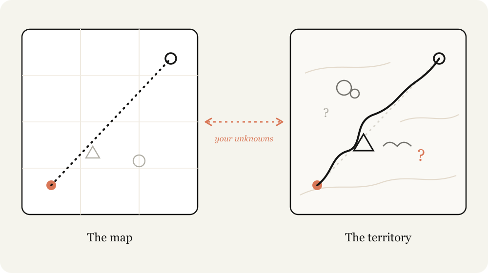
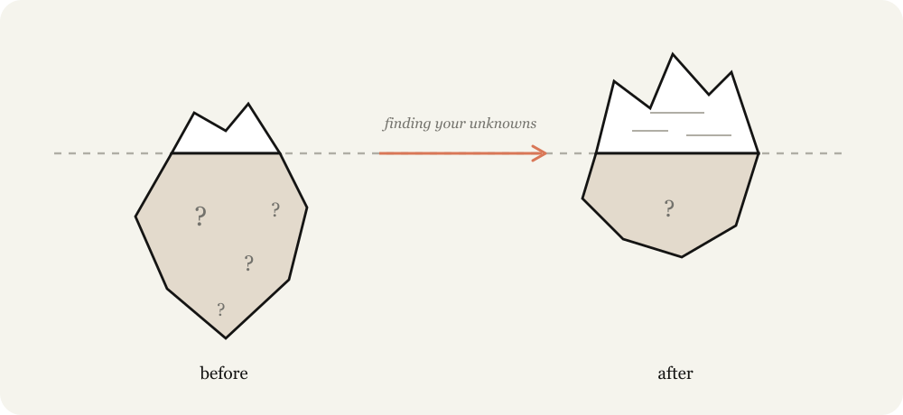

# Claude Fable 5 实战指南：找出你的未知项（中英对照）

> **原文标题：** A field guide to Claude Fable 5: Finding your unknowns
> **作者：** Thariq Shihipar, member of technical staff, Anthropic（Anthropic 技术团队成员）
> **原文链接：** https://claude.com/blog/a-field-guide-to-claude-fable-finding-your-unknowns
> **发布日期：** 2026-07-06
> **翻译模型：** GLM-5.3
> 排版：每段英文原文在前，中文翻译紧随其后。术语保留英文原文并附中文释义。

---

Practical patterns for agentic coding with Claude Fable: how to find your unknowns before, during, and after implementation, from the team at Anthropic.

来自 Anthropic 团队的 Claude Fable 智能体编码实用模式：如何在实现之前、之中与之后找出你的未知项（unknowns）。

When working with Claude Code, I'm often reminded of the difference between the map and the territory.

在使用 Claude Code 工作时，我常常想到"地图"与"疆域"之间的区别。

The map, a representation of the work to be done, is my prompts and skills and context, it's what I give Claude. The territory is where the work needs to happen, the codebase, the real world, its actual constraints.

地图是待完成工作的表征，也就是我的提示词、skills（技能）和上下文，是我交给 Claude 的东西。而疆域是工作真正要发生的地方：代码库、真实世界，以及它实际存在的约束。

The difference between the map and the territory is what I call unknowns. When Claude runs into an unknown, it needs to make a decision based on its best guess of what I want. The more work being done, the more unknowns Claude might run into.

地图与疆域之间的差异，我称之为"未知项"（unknowns）。当 Claude 遇到未知项时，它只能基于"我想要什么"的最佳猜测来做决定。要做的工作越多，Claude 可能遇到的未知项就越多。

Claude Fable is the first model where I find the quality of the work is bottlenecked by my ability to clarify its unknowns.

Claude Fable 是第一个让我感到"工作质量的瓶颈在于我澄清未知项的能力"的模型。

Importantly, just planning ahead isn't always enough. You can find unknowns deep in implementation, or your unknowns may point you to the fact that you should actually be solving the problem in a different way altogether.

重要的是，仅仅提前规划并不总是足够。你可能在实现的深处才发现未知项，也可能这些未知项会让你意识到：这个问题其实应该换一种完全不同的方式来解决。

I've found that working with Fable is an iterative process of discovering my unknowns before, during, and after implementation.

我发现，与 Fable 协作是一个迭代过程：在实现之前、之中与之后不断发现我的未知项。

# 认清你的未知项（Knowing your unknowns）

What are your unknowns? When I come to Claude with a problem I tend to break it down in 4 ways:

你的未知项是什么？当我带着问题来找 Claude 时，我倾向于把它拆成四类：

- Known Knowns: This is essentially what is in my prompt. What do I tell the agent that I want?
- Known Unknowns: What haven't I figured out yet, but I'm aware that I haven't?
- Unknown Knowns: What's so obvious I'd never write it down, but would recognize it if I saw it?
- Unknown Unknowns: What haven't I considered at all? What knowledge am I not aware of? Do I know how good something can be?

- 已知的已知（Known Knowns）：本质上就是提示词里的内容。我告诉了智能体我想要什么？
- 已知的未知（Known Unknowns）：哪些我还没想清楚，但我清楚自己还没想清楚？
- 未知的已知（Unknown Knowns）：哪些东西显而易见到我绝不会写下来，但一见就能认出来？
- 未知的未知（Unknown Unknowns）：哪些我压根没考虑过？哪些知识是我根本不知道自己欠缺的？我知道一样东西最好能好到什么程度吗？

The best agentic coders have relatively few unknowns. Watching someone like Boris or Jarred prompt, it is obvious to me that they know what they want in-detail. They are deeply in-sync with both the codebase and the model behaviors.

最优秀的 agentic coder（智能体编码者）的未知项相对很少。看 Boris 或 Jarred 这类人写提示词，我能很明显地感觉到他们对自己想要什么了然于胸。他们与代码库和模型行为都保持着深度同步。

But they also assume unknowns. In many ways, reducing and planning for your unknowns is the skill of agentic coding. But luckily, this is a skill you can improve at, by working with Claude.

但他们同样会预设未知项的存在。从很多方面看，减少未知项并为未知项做好规划，正是智能体编码的核心技能。好在这项技能可以通过与 Claude 协作来不断提升。

# 让 Claude 帮助你（Help Claude help you）

Instructing Claude is a delicate balance. If you are too specific, Claude will follow your instructions even when a pivot may be more appropriate. If you are too vague, Claude will often make choices and assumptions based on industry best practices that may not be a fit for your task.

给 Claude 下指令是一种微妙的平衡。如果过于具体，即使临时转向（pivot）可能更合适，Claude 也会照着你的指示执行；如果过于含糊，Claude 往往会依据行业最佳实践做出选择和假设，而这些未必适合你的任务。

When you don't account for your unknowns, you fail both ways. You don't know when the path will be filled with obstacles, and you don't know when the path will be clear, but you still want Claude to veer.

当你没有把未知项考虑进去时，两个方向都会出问题。你既不知道什么时候前路会布满障碍，也不知道什么时候道路畅通、但你其实希望 Claude 绕道而行。

Claude can help you discover your unknowns faster. It can search through your codebase and the internet extremely quickly, and it knows much more about the average topic than you. It can also iterate from failure faster.

Claude 可以帮你更快地发现未知项。它能极快地检索你的代码库和互联网，对一般话题的了解也远超于你。它从失败中迭代的速度也更快。

The most important part of this process is to give Claude context about your starting point. For example, tell it where you are in your thought process; disclose your experience with the problem and codebase; and let it work with you like a thought partner.

这个过程最重要的部分，是把你的起点背景告诉 Claude。比如：告诉它你的思路目前进展到哪一步；说明你在这个问题和代码库上的经验；让它像思维伙伴（thought partner）一样与你协作。

In this article I detail some of the patterns I use to uncover these unknowns including:

在本文中，我会详细介绍我用来挖掘这些未知项的一些模式，包括：

Pre-implementation:

实现之前：

- Blind spot pass
- Brainstorms and prototype
- Interviews
- References
- Implementation plan

- 盲点扫描（Blind spot pass）
- 头脑风暴与原型（Brainstorms and prototype）
- 访谈（Interviews）
- 参考示例（References）
- 实现计划（Implementation plan）

During implementation:

实现之中：

- Implementation notes

- 实现笔记（Implementation notes）

Post implementation

实现之后

- Pitches and explainers
- Quizzes

- 提案与讲解（Pitches and explainers）
- 小测验（Quizzes）

# 实现之前（Pre-implementation）

## 盲点扫描（Blind Spot Pass）

When starting work, one of the most useful things you can do is understand your blind spots. For example, if you're writing a feature in a new part of the codebase, or using Claude to help you with unfamiliar work like iterating on a design, you're likely to have a lot of unknown unknowns.

开始一项工作时，你能做的最有用的事情之一就是了解自己的盲区。例如，如果你要在代码库中一个陌生的部分编写功能，或者让 Claude 帮你做不熟悉的工作（比如迭代一个设计），你很可能有大量"未知的未知"。

You may not know what questions to ask, what good looks like, what historical work has been done, or what potholes to avoid.

你可能不知道该问什么问题、"好"是什么样子、历史上做过哪些相关工作，或者要避开哪些坑。

In these situations, you can ask Claude to help you find your unknown unknowns and explain them to you. I like to use the literal words "blind spot pass" and "unknown unknowns." Giving it context on who you are and what you know is usually important for Claude to understand the best way to start collaborating with you.

在这些情况下，你可以请 Claude 帮你找出未知的未知，并解释给你听。我喜欢直接使用"blind spot pass"和"unknown unknowns"这两个词。告诉它你是谁、你已经知道什么，通常很重要，这能帮助 Claude 找到与你协作的最佳起点。

Example prompts:

示例提示词：

- "I'm working on adding a new auth provider but I know nothing about the auth modules in this codebase. Can you do a blind spot pass to help me figure out my relevant unknown unknowns and help me prompt you better."
- "I don't know what color grading is but I need to grade this video. Can you teach me to understand my unknown unknowns about color grading, so that I can prompt better?"

- "我要添加一个新的 auth provider，但对这个代码库里的 auth 模块一无所知。你能做一次 blind spot pass，帮我找出相关的 unknown unknowns，好让我更会给你写提示词吗。"
- "我不知道什么是 color grading（调色），但我需要给这支视频调色。你能教我认识我在调色方面的 unknown unknowns，好让我能写出更好的提示词吗？"

## 头脑风暴与原型（Brainstorms and prototypes）

When I'm working in an area with a lot of unknown knowns, involving criteria I only know to define when I see it, I like to ask Claude to brainstorm and prototype with me.

当我在一个充满"未知的已知"的领域工作时--那些标准只有看到实物我才能说清--我喜欢请 Claude 和我一起头脑风暴、做原型。

It's extremely valuable to identify and verbalize unknown knowns early during prototyping, because finding them out during implementation can be (relatively) expensive. Small changes in a feature or spec can cause drastically different implementations in code, and it can be more difficult for your agent to revert previous changes.

在原型阶段尽早识别并说出这些"未知的已知"极有价值，因为拖到实现阶段才发现，代价可能（相对）高昂。功能或规格上的小改动可能导致代码实现的大幅不同，而且智能体要回退之前的改动也会更困难。

For example, you may just want to see how a button added to a frame looks without having to wire up a backend route or maintaining additional state in the frontend.

例如，你可能只想看看在某个界面里加一个按钮的效果，而不想为此接上后端路由，也不想在前端维护额外的状态。

Another example is visual design, which for me, is something that is difficult to articulate, but I know what I want when I see it. In these cases, I'll ask for several design approaches to an artifact.

另一个例子是视觉设计。对我来说，这类东西很难用语言描述，但一眼看到我就知道是不是想要的。遇到这种情况，我会请 Claude 就同一个产出物给出几种设计方案。

I also start almost every coding session with an exploration or brainstorming phase. This helps me start with intent to define the project's scope. Claude often finds high-value approaches I would have missed, and sometimes misses the forest through the trees. Brainstorming prevents me from setting too narrow or too wide a scope.

几乎每次编码会话，我都会以一个探索或头脑风暴阶段开场。这能让我带着明确意图去界定项目范围。Claude 常常能发现我会错过的高价值方案，有时也会见树不见林。头脑风暴能防止我把范围定得过窄或过宽。

Example prompts:

示例提示词：

- "I want a dashboard for this data but I have no visual taste and don't know what's possible. Make me an HTML page with 4 wildly different design directions so I can react to them."
- "Before wiring anything up, make a single HTML file mocking the new editor toolbar with fake data. I want to react to the layout before you touch the real app."
- "Here's my rough problem: users churn after onboarding. Search the codebase and brainstorm 10 places we could intervene, from cheapest to most ambitious. I'll tell you which ones resonate."

- "我想为这份数据做一个 dashboard，但我毫无审美，也不知道有哪些可能。给我做一个 HTML 页面，包含 4 个截然不同的设计方向，好让我对着它们提意见。"
- "在动手接线之前，先用一个单独的 HTML 文件、用假数据把新的编辑器工具栏 mock 出来。我想在你碰真实应用之前先对布局提意见。"
- "这是我遇到的大致问题：用户在完成 onboarding 之后就流失了。搜索代码库，头脑风暴出 10 个我们可以介入的位置，从成本最低到最有雄心排列。我会告诉你哪些让我有共鸣。"

## 访谈（Interviews）

Once I've done sufficient brainstorming, I likely still have unknowns.

头脑风暴做得足够充分之后，我很可能仍留有未知项。

In this case, I ask Claude to interview me about any unknowns or ambiguities. When asking Claude to interview you, try and give it context about your problem to guide its questions.

这时，我会请 Claude 就任何未知或含糊之处来访谈我。请 Claude 访谈你时，尽量把问题的相关背景告诉它，好引导它提问。

Example prompt:

示例提示词：

- "Interview me one question at a time about anything ambiguous, prioritize questions where my answer would change the architecture."

- "就任何含糊之处对我做访谈，一次只问一个问题，优先问那些我的回答会改变架构的问题。"

## 参考示例（References）

Sometimes you can't describe what you want in detail. For example, you might not have the language or it might be so complicated that it would take you quite a while.

有时你无法详细描述自己想要什么。比如，你可能缺少相应的语言，或者它复杂到要说清楚得花上不少时间。

In this case, the best approach is a reference. While you can include diagrams, documentation or pictures, the absolute best reference is source code.

这种情况下，最好的办法是给参考示例（reference）。图示、文档或图片都可以用，但最好的参考是源代码。

If you have a library that implements something in a certain way or a design component you really like, just point Fable at the folder and tell it what to look for, even if it's in a different language. This provides Claude much richer detail around the markup and structure, compared to for example a screenshot.

如果你有一个以某种方式实现了特定功能的库，或者一个你特别喜欢的设计组件，直接让 Fable 指向那个文件夹并告诉它要找什么，哪怕那是用另一种语言写的。相比截图之类的方式，这能给 Claude 提供远为丰富的标记与结构细节。

Example prompts:

示例提示词：

- "This Rust crate in vendor/rate-limiter implements the exact backoff behavior I want. Read it and reimplement the same semantics in our TypeScript API client."

- "vendor/rate-limiter 里的这个 Rust crate 实现了我想要的确切 backoff（退避）行为。读一读它，然后在我们的 TypeScript API 客户端里重新实现同样的语义。"

## 实现计划（Implementation Plans）

When I think I'm ready to implement, I tend to ask Claude to put together an implementation plan for me to review. The plan focuses on the parts that might be most likely to change such as data models, type interfaces, or UX flows. This allows Claude to surface things I might actually need to alter.

当我觉得可以开始实现时，我倾向于请 Claude 起草一份实现计划供我审阅。计划聚焦于最可能变动的部分，比如数据模型、类型接口或 UX 流程。这样 Claude 就能把我可能确实需要修改的东西提前摆到台面上。

Example prompt:

示例提示词：

- "Write an implementation plan in HTML, but lead with the decisions I'm most likely to tweak with: data model changes, new type interfaces, and anything user-facing. Bury the mechanical refactoring at the bottom, I trust you on that part."

- "用 HTML 写一份实现计划，但把我最可能想调整的决策放在最前面：数据模型变更、新的类型接口，以及所有面向用户的内容。机械式的重构放到最后，那部分我信任你。"

# 实现之中（During implementation）

## 实现笔记（Implementation notes）

Once I am satisfied with my plan, I make a new session and pass any artifacts to the prompt. This gives Claude a fresh context window but with all of the information it compiled from your planning. For example, I might pass in a spec file and a prototype and ask an agent to implement it.

对计划满意后，我会新开一个会话，把所有产出物（artifacts）放进提示词里。这样 Claude 拥有一个全新的上下文窗口，同时又带着规划阶段整理好的全部信息。比如，我可能传入一份规格文件和一个原型，然后让智能体去实现。

But the truth is that no matter how much planning you do, there are always unknown unknowns lurking. The agent may find during its work that it needs to take a different tack due to an edge case it found in the code.

但真相是，无论做多少规划，总有潜藏的未知未知。智能体可能在工作中发现代码里的某个边界情况，从而需要改弦更张。

I ask Claude Code to keep a temporary 'implementation-notes.md' (or .html) file where it keeps track of decisions it makes so we can learn for our next attempt.

我会让 Claude Code 维护一个临时的 'implementation-notes.md'（或 .html）文件，记录它做出的各项决定，以便我们在下一次尝试中学习改进。

Example prompt:

示例提示词：

- "Keep an implementation-notes.md file. If you hit an edge case that forces you to deviate from the plan, pick the conservative option, log it under 'Deviations', and keep going."

- "维护一个 implementation-notes.md 文件。如果遇到迫使你偏离计划的边界情况，就选择保守的选项，把它记录到 'Deviations' 之下，然后继续。"

# 实现之后（Post implementation）

## 提案与讲解（Pitches and explainers）

One of the most important parts of shipping something is getting buy-in and approvals. Building pitch and explainer artifacts in the final document helps:

发布一项成果最重要的环节之一，是获得认同（buy-in）与审批。在最终文档中构建提案与讲解材料可以帮助：

- Accelerate understanding when reviewers start with the same unknowns you did
- Accelerate approvals when experts want to see you accounted for the unknowns and common failure points they would have anticipated

- 当评审者一开始与你有着同样的未知项时，加快他们理解
- 当专家想确认你已考虑他们预想中的未知项与常见失败点时，加快审批

Example prompt:

示例提示词：

- "Package the prototype, the spec, and the implementation notes into a single doc I can drop in Slack to get buy-in. Lead with the demo GIF."

- "把原型、规格和实现笔记打包成一份单独的文档，让我能直接发到 Slack 里争取认同。开头就放演示 GIF。"

## 小测验（Quizzes）

After a long working session, Claude might have accomplished a lot more than I realized. Reading the code diffs can only give me a light understanding of what happened, since much of the behavior will depend on existing code paths.

一场长时间的工作会话之后，Claude 完成的东西可能远超我的想象。读代码 diff 只能让我对发生的事情有个粗浅的了解，因为很多行为取决于已有的代码路径。

Asking Claude to quiz me about the change after giving me a bunch of context helps me understand what happens. I only merge after I pass the quiz perfectly.

让 Claude 先给我大量背景，然后就这次改动考考我，能帮我真正理解会发生什么。只有完美通过测验，我才会合并（merge）。

Example prompt:

示例提示词：

- "I want to make sure I understand everything that's happened in this change. Give me a HTML report on the changes for me to read and understand with context, intuition, what was done, etc. and a quiz at the bottom on the changes that I must pass."

- "我想确保自己理解这次改动中发生的一切。给我一份关于这些改动的 HTML 报告，包含背景、直觉解释、做了什么等内容供我阅读理解，并在最后附上一个我必须通过的测验。"

# 一套打法如何串起来：Fable 发布实战（How this comes together: launching Fable）

The launch video for Fable was edited end-to-end using Claude Code. This was a new domain for me and I'm by no means an expert.

Fable 的发布视频从始至终都是用 Claude Code 剪辑的。这对我来说是一个全新领域，我绝不是专家。

So I started with what I did know. I knew that Claude could use code to edit videos and transcribe them, but I wasn't sure if it was accurate enough. I then asked Claude to explain to me how transcription like Whisper worked, and whether I would be able to accurately cut out things like ums or large pauses using ffmpeg.

于是我从自己确实知道的东西入手。我知道 Claude 能用代码剪辑视频、做转写，但不确定精度够不够。于是我请 Claude 给我讲解 Whisper 之类转写技术的工作原理，以及我能否用 ffmpeg 精确地剪掉"嗯"之类的口头语或长时间的停顿。

I wanted Claude to create a UI that was timed with the words I was saying, but wasn't sure it was possible so I asked Claude to create a prototype video using Remotion and a transcription to see if it would work.

我想让 Claude 做一个与我所说词语同步的 UI，但不确定是否可行，于是请 Claude 用 Remotion 和一份转写做一个原型视频，看看行不行。

Finally, the video itself looked a bit muted, which I knew was the result of color grading but I didn't really know what color grading was. My first pass attempt was to try and get Claude to do a few variations to pick, but I realized that I didn't know what "good" looked like when it came to color grading. So instead, I asked Claude to teach me about color grading to discover my unknowns.

最后，视频本身看起来有点闷。我知道这是调色（color grading）的结果，但我并不真正懂什么是调色。我的第一反应是让 Claude 做几个变体供我挑选，但我意识到，在调色这件事上我根本不知道"好"是什么样子。于是我改为请 Claude 教我调色知识，来发现我的未知项。

# 让地图与疆域相吻合（Matching the Map and Territory）

The better models get, the more you can achieve with the right approach. When a long-horizon task comes back wrong, it's likely you need to spend more time defining your unknowns or creating an implementation plan that allows for you and Claude to adapt through them.

模型越强，用对方法你能取得的成果就越多。当一个长周期（long-horizon）任务的结果不对时，很可能你需要花更多时间界定你的未知项，或者制定一份允许你和 Claude 随之灵活调整的实现计划。

Every explainer, brainstorm, interview, prototype, and reference is a cheap way to find out what you didn't know before it gets expensive to fix.

每一份讲解、每一次头脑风暴、每一场访谈、每一个原型和每一个参考示例，都是在修复代价变得高昂之前，低成本发现"你原本不知道什么"的方式。

So start your next project by asking Claude to help you find your unknowns.

所以，开始下一个项目时，就请 Claude 帮你找出你的未知项吧。

For the context side of working with Fable-generation models, see the new rules of context engineering.

关于与 Fable 这一代模型协作时上下文层面的注意事项，请参阅 the new rules of context engineering（上下文工程的新规则）。

This article was written by Thariq Shihipar, member of technical staff, Anthropic.

本文由 Thariq Shihipar（Anthropic 技术团队成员）撰写。
