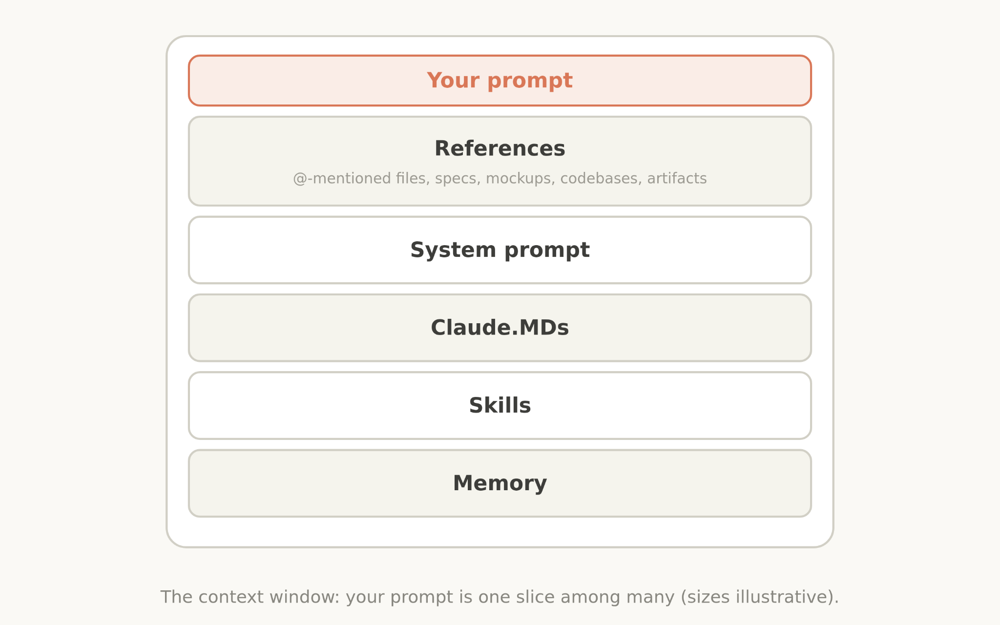

# 面向 Claude 5 代模型的上下文工程新规则（中英对照）

> **原文标题：** The new rules of context engineering for Claude 5 generation models
> **作者：** Thariq Shihipar（Anthropic 技术团队成员）
> **原文链接：** https://claude.com/blog/the-new-rules-of-context-engineering-for-claude-5-generation-models
> **发布日期：** 2026-07-24
> **翻译模型：** GLM-5.3
> 排版：每段英文原文在前，中文翻译紧随其后。术语保留英文原文并附中文释义。

---

We removed over 80% of Claude Code's system prompt for more advanced models. How to apply the lessons we learned to your own context engineering in Claude Code and with your own agents.

针对更先进的模型，我们删掉了 Claude Code 系统提示词中超过 80% 的内容。如何把我们学到的经验应用到你在 Claude Code 中的、以及构建自己 Agent 时的上下文工程里。

I've written previously about how to best prompt the newest generation of Claude 5 models and work with them iteratively to discover what you want to build.

我此前写过如何最好地为最新一代 Claude 5 模型编写提示词，以及如何与它们迭代协作、逐步发现你想要构建的东西。

But when you send a message to Claude, the prompt is only a small part of the context it gets. Much of your context is assembled from your system prompt, Skills, CLAUDE.md files, memory, and other sources. We call this context engineering, and it makes a big impact on the results you generate when using Claude Code or in building your own agents.

但当你向 Claude 发送一条消息时，提示词只是它所获得上下文的一小部分。你的上下文大部分是由系统提示词（system prompt）、Skills、CLAUDE.md 文件、记忆（memory）等来源组装而成的。我们称之为上下文工程（context engineering），它对你使用 Claude Code 或构建自己的 Agent 时所能产出的结果有着巨大影响。

Unlike a prompt, context is used generally across many requests, so it cannot be as specific. How do you build these general prompts and guidance for Claude, especially when you don't know what a user's prompt might be?

与提示词不同，上下文会在很多次请求中被通用使用，因此它无法做到那么具体。你该如何为 Claude 构建这些通用的提示词和指导，尤其是在你并不知道用户的提示词可能是什么的情况下？

This can be surprisingly difficult as Claude's own capabilities evolve. Most recently, we noticed a large jump in the way we prompt the newest generation of Claude models. We removed over 80% of Claude Code's system prompt for models like Claude Opus 5 and Claude Fable 5 with no measurable loss on our coding evaluations.

随着 Claude 自身能力的演进，这件事会出人意料地困难。就在最近，我们注意到为最新一代 Claude 模型编写提示词的方式发生了一次大跃迁。针对 Claude Opus 5 和 Claude Fable 5 等模型，我们删掉了 Claude Code 系统提示词中超过 80% 的内容，而在我们的编码评测上没有出现可测量的损失。

Here's what we've learned about prompting this new class of models, and how you can utilize it to update your context engineering. We've put these best practices in `claude doctor;` use the command /doctor in Claude Code to rightsize your skills, and CLAUDE.md files.

以下是我们关于为这类新模型编写提示词所学到的经验，以及你如何利用它们来更新自己的上下文工程。我们已把这些最佳实践内置到了 `claude doctor` 之中；在 Claude Code 里使用 /doctor 命令，即可为你的 skills 和 CLAUDE.md 文件"裁剪合身"（rightsize）。

# 解除 Claude 的束缚（Unhobbling Claude）

Overall, we found that we were overconstraining Claude Code, both through our system prompt and in our CLAUDE.md files and skills.

总体而言，我们发现自己在过度约束 Claude Code--无论是通过系统提示词，还是通过 CLAUDE.md 文件和 skills。

For example, when we read transcripts of our own internal usage of Claude Code, we see several conflicting messages in a single request like "leave documentation as appropriate," or "DO NOT add comments" as our system prompt, skills, and user requests clash with each other.

举例来说，当我们阅读自己内部使用 Claude Code 的会话记录（transcript）时，会看到同一次请求中出现多条相互冲突的指令，比如"酌情保留文档"或"不要（DO NOT）添加注释"——这是我们的系统提示词、skills 和用户请求相互冲突的结果。

Generally, Claude can interpret the user's intent to get to the right answer, but Claude must think more carefully about these overlapping and conflicting messages before deciding what to do.

一般来说，Claude 能够解读用户意图、得出正确答案，但 Claude 必须先更仔细地斟酌这些相互重叠又彼此冲突的信息，才能决定怎么做。

And while these constraints were once needed to avoid worst case scenarios, we have since found we can delete many of them and let the model use surrounding context and judgement instead.

虽然这些约束曾经是为避免最坏情形（worst case scenario）所必需的，但我们后来发现可以删掉其中许多，转而让模型运用周边上下文和自身判断力（judgement）。

Additionally, Claude Code now has many more tools. Claude used to rely on CLAUDE.md as a source of memory, information, and guidance. Now we have memory, artifacts, and skills, which Claude can use to create new ways of loading and sharing context across sessions.

此外，Claude Code 现在拥有多得多的工具。Claude 过去依赖 CLAUDE.md 作为记忆、信息和指导的来源。现在我们有了记忆（memory）、artifacts 和 skills，Claude 可以用它们创造出跨会话加载和共享上下文的新方式。

# 过去与现在（Then and now）

There were a number of previous context engineering best practices that had become myths. Including:.

有许多过去的上下文工程最佳实践，如今已变成了迷思（myth）。包括：

## 过去：给 Claude 立规则；现在：让 Claude 运用判断力（Then: Give Claude rules / Now: Let Claude use judgement）

When we first rolled out Claude Code, we needed to be sure that Claude avoided worst case scenarios, such as deleting files. This meant we would give particularly strong guidance that might not always be true, For example, in the system prompt we used to say:

刚推出 Claude Code 时，我们必须确保 Claude 避免最坏情形，比如删除文件。这意味着我们会给出一些特别强硬、却未必总是正确的指导。例如，系统提示词里我们过去这样写：

> In code: default to writing no comments. Never write multi-paragraph docstrings or multi-line comment blocks - one short line max. Don't create planning, decision, or analysis documents unless the user asks for them - work from conversation context, not intermediate files.

> 在代码中：默认不写注释。绝不编写多段 docstring 或多行注释块——最多一行短注释。除非用户要求，否则不要创建规划、决策或分析文档——基于会话上下文工作，而非中间文件。

But for a certain subset of prompts, this guidance would be wrong. In the case of documentation, the user may have their own preferences, or specific parts of very complex code might need multi-line comment blocks.

但对于某一类提示词而言，这样的指导会是错的。以文档为例，用户可能有自己的偏好，或者非常复杂的代码中某些特定部分可能确实需要多行注释块。

Still, without these guardrails for older models, the comments Claude wrote would be incorrect in many cases and we had to accept this tradeoff. But newer models have better judgement and can handle these decisions well without explicit rules.

尽管如此，对旧模型而言，若没有这些护栏（guardrail），Claude 写出的注释在很多情况下会出错，我们不得不接受这种权衡。但新模型的判断力更好，无需显式规则也能妥善处理这些决策。

In the new system prompt we say: Write code that reads like the surrounding code: match its comment density, naming, and idiom.

在新的系统提示词中，我们只说：写出与周边代码读起来一致的代码：匹配它的注释密度、命名和惯用写法。

## 过去：给 Claude 示例；现在：设计接口（Then: Give Claude examples / Now: Design interfaces）

The number one rule for tool usage was to give Claude examples on how to use them. With our newest models, we've found that giving examples actually constrains them to a certain exploration space.

关于工具使用，过去的第一法则是给 Claude 提供如何使用工具的示例。而对于最新模型，我们发现提供示例实际上会把它们约束在某个特定的探索空间里。

Instead of using examples, think more about the design of your tools, scripts and files- what parameters does Claude have and how can they be more expressive?

与其使用示例，不如多思考你的工具、脚本和文件的设计--Claude 手里有哪些参数？如何让这些参数更具表达力？

For example, in the Todo tool example, just listing status as an enumeration between pending, in_progress, and completed, hints to Claude about how to use it. The instruction on keeping one item in_progress helps define our requested behavior.

例如，在 Todo 工具的例子中，仅把 status 列为 pending、in_progress、completed 之间的一个枚举值，就向 Claude 暗示了该如何使用它；而"始终保持一项处于 in_progress"的说明则帮助界定了我们期望的行为。

## 过去：把一切都放在最前面；现在：使用渐进式披露（Then: Put it all upfront / Now: Use progressive disclosure）

Because Claude Code was focused on coding, our system prompt included detailed information on how to do code review and verification. These were not always needed, but when they were, it was crucial information.

由于 Claude Code 专注于编码，我们的系统提示词中包含了如何做代码评审（code review）和验证（verification）的详细信息。这些信息并不总是被用到，但一旦用到，就是至关重要的。

Since then, Claude Code has gotten very competent at using progressive disclosure- loading the right context at the right times. For example, we moved verification and code review into their own skills that Claude Code could selectively call.

从那以后，Claude Code 已经变得非常擅长使用渐进式披露（progressive disclosure）--在恰当的时机加载恰当的上下文。例如，我们把验证和代码评审移入了各自的 skills，由 Claude Code 按需选择调用。

But progressive disclosure is not just for skills, we also use it for tools. Some of our tools are 'deferred loading,' which means the agent must search for their full definitions using ToolSearch before using them. This allows us to have more tools (such as our Task tools) that don't take up context until they're needed.

但渐进式披露不仅适用于 skills，我们也把它用在工具上。我们的部分工具采用"延迟加载"（deferred loading），即 Agent 必须先通过 ToolSearch 检索到它们的完整定义才能使用。这让我们能配备更多工具（例如我们的 Task 工具），它们在需要之前不会占用上下文。

The same can be applied to your own CLAUDE.md and Skill.md files. A common myth is that you want to make these a central repository for every known practice that you might run into, because Claude would not find it otherwise. Instead, consider having a tree of files that can be loaded at the right time.

同样的做法也适用于你自己的 CLAUDE.md 和 SKILL.md 文件。一个常见迷思是：应该把这些文件做成收录一切可能遇到的已知实践的中央仓库，否则 Claude 就找不到。实际上，不妨改用一棵文件树，让内容在恰当的时机被加载。

## 过去：重复自己；现在：简洁的工具描述（Then: Repeat yourself / Now: Simple tool descriptions）

Earlier Claude models could sometimes need repeated instructions or be more likely to listen to instructions at the end of their context window than at the start. This meant our system prompt would sometimes have references to tools in the main system prompt as well as instructions in the tool description.

早期的 Claude 模型有时需要重复的指令，或者更容易听取上下文窗口末尾而非开头的指令。这意味着我们的系统提示词中，有时既有对工具的引用（放在主系统提示词里），又有工具用法说明（放在工具描述里）。

We found we could delete these repeat examples and put instructions on how to use tools in the tool descriptions rather than the system prompt.

我们发现可以删掉这些重复的示例，把工具用法的说明放进工具描述，而非系统提示词里。

## 过去：用 CLAUDE.md 文件当记忆；现在：自动记忆（Then: Memory in CLAUDE.md files / Now: Auto-memory）

We used to encourage users to save things to Claude's memory, by using the # hotkey to write to their CLAUDE.md automatically. Instead, Claude now automatically saves memories that are relevant to the work and to you.

我们过去鼓励用户把内容保存到 Claude 的记忆中--用 # 快捷键自动写入他们的 CLAUDE.md。而现在，Claude 会自动保存与当前工作和你本人相关的记忆（auto-memory）。

## 过去：简单规格；现在：丰富引用（Then: Simple specs / Now: Rich references）

In plan mode, Claude Code has heavily relied on markdown files with plans. Storing these files as plans helped Claude refer to them when needed. Another similar best practice was to store specs in the codebase for Claude to refer to while working across longer projects.

在计划模式（plan mode）中，Claude Code 曾高度依赖 markdown 格式的计划文件。把这些文件存为计划，便于 Claude 在需要时查阅。另一个类似的最佳实践是把规格（spec）存放在代码库中，供 Claude 在较长的项目里随时参照。

But we've found that Claude can handle increasingly more complicated references. Instead of simple markdown files, Claude can reference HTML artifacts created by our new artifacts feature.

但我们发现 Claude 能处理越来越复杂的引用（reference）。除了简单的 markdown 文件，Claude 还能引用由我们新的 artifacts 功能创建的 HTML artifact。

You may also give Claude references in the form of code. A spec may also be a detailed test suite, or a function in a different codebase that Claude might port.

你也可以用代码的形式给 Claude 提供引用。一份规格也可以是一套详尽的测试套件，或是另一个代码库里某个可供 Claude 移植（port）过来的函数。

Rubrics are another form of references. Rubrics allow Claude to try and verify your taste in a particular field (e.g. what does a good API design look like) by using dynamic workflows and spinning up verifier agents with those rubrics.

评分量规（rubric）是另一种形式的引用。量规让 Claude 能够尝试校验你在特定领域的品味（例如：好的 API 设计长什么样）--做法是使用动态工作流（dynamic workflow），并基于这些量规启动验证者 Agent（verifier agent）。

# 把这些应用到你的上下文（Applying this to your context）

Pulling this all together, what does this look like when you assemble your context?

把以上内容串联起来，当你组装自己的上下文时，它看起来是什么样的？

## 系统提示词（System Prompt）

A system prompt is heavily tied to the product context. It tells Claude what product it's operating in and what it's doing. For Claude Code, you will likely never modify this, but if you are building your own agent harness, this is where you should spend a lot of time.

系统提示词与产品语境紧密相关。它告诉 Claude 自己运行在什么产品里、正在做什么。对 Claude Code 而言，你大概率永远不会去改它；但如果你在构建自己的 Agent harness，这里正是你应该花大量时间的地方。

## CLAUDE.md

Keep your CLAUDE.md lightweight and briefly describe what your repo is for, but spend most of the tokens on gotchas inside of the codebase. For example, you may organize your code to keep types in one monolithic file and nowhere else. Avoid stating 'the obvious' things Claude should know by looking at your file system or your repo.

保持 CLAUDE.md 轻量，简要说明你的仓库是做什么的，而把大部分令牌（token）花在代码库内部的"坑"（gotcha）上。例如，你可能把代码组织成所有类型都集中放在一个大文件里、别处一律不放。避免陈述那些 Claude 看一眼文件系统或仓库就能知道的"显而易见"之事。

Use progressive disclosure heavily, for example if you have several unique instructions on how to verify your work, create a verification skill and reference it from your CLAUDE.md.

大量使用渐进式披露。例如，如果你有多条关于如何验证工作成果的独特指令，可以创建一个验证 skill，然后在 CLAUDE.md 里引用它。

## Skills

Think of skills as lightweight guides to let Claude find information when needed. Avoid making them overconstrained, except in highly important areas.

把 skills 当作轻量的指南，让 Claude 在需要时自行查找信息。避免过度约束它们，除非是在极其重要的领域。

For long skills, try and use progressive disclosure as much as possible- divide it into many files and split them out.

对于很长的 skill，请尽量多用渐进式披露--把它拆分成许多文件、分散出去。

It's best when skills encode particular opinions, knowledge, or best practices that are particular to you, your team, or product.

skills 最好的用法，是承载那些专属于你、你的团队或你的产品的特定观点、知识或最佳实践。

## 引用（References）

You can @ mention files to include them as references. References allow Claude to refer to in-depth information about the current plan.

你可以通过 @ 提及（mention）文件来把它们纳入引用。引用让 Claude 能够查阅与当前计划相关的深入信息。

This might be in specs files, mockups, or even entire codebases. Generally you should prefer files that are in code as it provides clear, high-fidelity instructions to Claude in a language it knows very well. For example, a HTML mockup of a design will generally produce better results than a description of the design or a screenshot.

这些信息可能在规格文件、设计稿（mockup）甚至整个代码库里。一般来说，你应优先选择以代码形式存在的文件，因为它能用 Claude 非常熟谙的语言，向它提供清晰、高保真的指令。例如，一份 HTML 设计稿通常比一段设计描述或一张截图效果更好。

# 试着做减法（Try simplifying）

Across your system prompt, skills, and CLAUDE.md files, you may need to simplify just like we did. We rolled out a new command called `claude doctor,` which will help you do this automatically as well. For more details on prompting more advanced models specifically, check out our Fable field guide.

在系统提示词、skills 和 CLAUDE.md 文件这些地方，你可能也需要像我们一样做减法。我们推出了一条新命令 `claude doctor`，同样可以帮你自动完成这项工作。关于专门针对更先进模型编写提示词的更多细节，请参阅我们的 Fable 实地指南（Fable field guide）。

This article was written by Thariq Shihipar, member of technical staff, Anthropic.

本文作者为 Thariq Shihipar，Anthropic 技术团队成员。
