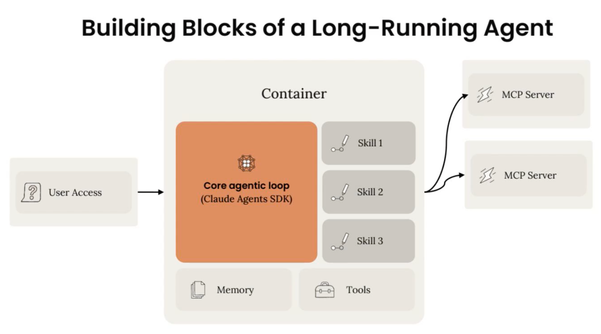

# Outtake 如何基于 Claude 构建网络犯罪调查员（中英对照）

> **原文标题：** How Outtake built a cyber investigator on Claude
> **作者：** Anthropic（原文未署名）
> **原文链接：** https://claude.com/blog/how-outtake-built-a-cyber-investigator-on-claude
> **发布日期：** 2026-07-22
> **翻译模型：** GLM-5.3
> 排版：每段英文原文在前，中文翻译紧随其后。术语保留英文原文并附中文释义。

---

How Outtake ensures multi-hour agent sessions stay on track to uncover attack network operations

Outtake 如何确保长达数小时的代理会话始终走在正轨上，揭开攻击网络的运作

In our series, How startups build with Claude, we highlight how startups are transforming their industries with AI. In this article, we share how Outtake built an autonomous cyber investigator that detects, investigates, and dismantles digital threats, from cloned login pages to entire adversarial networks.

在我们的"如何用 Claude 构建"（How startups build with Claude）系列中，我们聚焦初创公司如何用 AI 变革各自所在的行业。本文将分享 Outtake 如何构建一个自主网络犯罪调查员（autonomous cyber investigator），它能检测、调查并拆解各类数字威胁--从克隆登录页面到整个对抗性网络（adversarial networks）。

| The quick pitch |  |
| --- | --- |
| Name | Outtake |
| Founded | 2023 |
| Founders | Alex Dhillon (CEO), formerly of Palantir's moonshot team |
| Growth | Grew annual recurring revenue 6x and its customer base more than 10x year-over-year, scanning 20M+ potential cyberattacks in 2025 alone. |

| 快速简介 |  |
| --- | --- |
| 名称 | Outtake |
| 成立时间 | 2023 |
| 创始人 | Alex Dhillon（CEO），曾任职于 Palantir 的登月（moonshot）团队 |
| 增长 | 年经常性收入增长 6 倍，客户规模同比增长逾 10 倍；仅 2025 年就扫描了 2000 万次以上潜在网络攻击。 |

Even with strong safeguards and controls, bad actors can mask their use of AI in seemingly benign purposes that hide their malicious intent. Code generation platforms can create convincing login portals, agentic go-to-market tooling can power the distribution of phishing attacks, and image generation capabilities can spoof identity. Traditional cybersecurity defenses struggle to keep up.

即便有强大的防护措施与管控手段，不法分子（bad actors）仍可以把对 AI 的使用伪装成看似正当的用途，借以隐藏其恶意意图。代码生成平台可以创建以假乱真的登录门户，代理式（agentic）营销投放工具可以助推钓鱼攻击的分发，图像生成能力则可以伪造身份。传统网络安全防御难以跟上这些变化。

“If you put on the bad actor's hat, it's actually a great time to be running attacks,” says Alex Dhillon, founder and CEO of AI cybersecurity platform Outtake. “The average attack is not only executed faster because of AI, but it also captures deeper access due to AI”

"如果你戴上不法分子的帽子，现在其实是发起攻击的大好时机，"AI 网络安全平台 Outtake 的创始人兼 CEO Alex Dhillon 说。"由于 AI，普通攻击不仅执行得更快，还能攫取更深层的访问权限"

Outtake unifies the full digital trust attack chain into a single defense, using fleets of AI agents to autonomously detect, investigate, and dismantle threats aimed at their customers, which include leading AI labs, major hedge funds, and US federal agencies.

Outtake 将完整的数字信任攻击链（digital trust attack chain）统一到单一防御体系之中，利用 AI 代理集群自主检测、调查并拆解针对其客户的威胁--这些客户包括领先的 AI 实验室、大型对冲基金以及美国联邦机构。

Here’s how the Outtake team recently built the Recon Agent, a long-running autonomous cyber investigator, on Claude using Claude Code and the Agent SDK.

下面介绍 Outtake 团队最近如何使用 Claude Code 和 Agent SDK，基于 Claude 构建长时间运行的自主网络犯罪调查员--Recon Agent。

# 代理式攻击需要代理式防御（Agentic offense needs agentic defense）

When targeting a company, attackers typically move through the same process: weaponize public data → build impersonations as lures → exploit internal systems. This process has been accelerated by AI.

在攻击一家公司时，攻击者通常遵循同样的流程：将公开数据武器化 → 搭建假冒身份作为诱饵 → 攻破内部系统。这一流程已被 AI 加速。

Before breaking into anything, they harvest publicly available information about an organization, and its executives and employees.

在真正入侵任何东西之前，他们会大量收集关于目标组织及其高管和员工的公开信息。

They then turn that intelligence into bait, like a fake website with a fraudulent login page, to trick victims into handing over credentials. The access gained from these lures help the attacker get inside the perimeter to reach an organization’s most valuable and sensitive assets.

随后，他们把这些情报转化为诱饵，比如带有欺诈性登录页面的假网站，诱骗受害者交出凭据。通过这些诱饵获得的访问权限，帮助攻击者突破边界防线，触及组织最有价值、最敏感的资产。

This three-part sequence is predictable, but legacy security tooling guards only one slice at a time:

这三步流程是可以预判的，但传统安全工具一次只防守其中一个环节：

- Threat intelligence tools monitor the public-data stage,
- Brand protection tools watch for impersonations, and
- Endpoint tools guard the internal systems.

- 威胁情报（threat intelligence）工具监控公开数据阶段，
- 品牌保护（brand protection）工具盯防假冒仿冒行为，
- 终端（endpoint）工具守护内部系统。

Outtake’s Recon Agent investigates the full network behind an impersonation. Instead of just taking down a cloned login page, for example, the agent gathers and classifies evidence from the impersonation event.

Outtake 的 Recon Agent 会调查假冒行为背后的整个网络。例如，它不只是下线一个克隆登录页面，而是从该假冒事件中收集证据并加以分类。

It follows those leads to connected infrastructure, like a fake Telegram account that presents itself as “Customer Support,” and maps this adversarial network in a graph. The agent’s final step produces a report explaining the investigation process, a profile of the threat actor, and a reconstructed timeline of what the attacker did.

它顺着线索追查关联基础设施，比如一个自称"客服"（Customer Support）的假冒 Telegram 账号，并将这张对抗性网络绘制成图。代理的最后一步会产出一份报告，内容包括调查过程的解释、威胁行为者（threat actor）画像，以及重建的攻击者行为时间线。

To carry out this sophisticated workflow, the Recon Agent can read, write, and run code. It can even interact with malicious login pages directly to see where stolen credentials actually go.

为了执行这套复杂的工作流，Recon Agent 能够读取、编写并运行代码。它甚至可以直接与恶意登录页面交互，查看被盗凭据最终流向何处。

These investigations can require agents to run autonomously for long periods of time. Agent sessions run a median of 16 minutes, but routinely stretch to an hour and beyond; the longest run thus far lasted two hours of agentic work before returning results.

这类调查可能需要代理长时间自主运行。代理会话的中位时长为 16 分钟，但经常延长到一小时甚至更久；迄今为止最长的一次运行，在返回结果前持续了两个小时的代理式工作。

# Outtake 如何用 Claude 构建复杂的长时间运行代理（How Outtake built a complex long-running agent with Claude）

Outtake built the Recon Agent in roughly four stages. Each stage was about understanding what a good investigation looked like, then progressively handing that judgment to the agent.

Outtake 大致分四个阶段构建 Recon Agent。每个阶段的要点都是理解"什么是好的调查"，然后把这种判断力逐步移交给代理。

## 第 1 步：先成为专家（Step 1: Become the expert first.）

Before building any part of the agent, Outtake's engineers ran real cyber investigations themselves and pulled domain expertise from customers and design partners.

在构建代理的任何部分之前，Outtake 的工程师先亲自执行真实的网络调查，并从客户和设计合作伙伴（design partner）那里汲取领域专业知识。

The goal was to define what "good" looks like. For these types of investigations, that meant identifying what evidence matters, how to organize it, and what separated an actionable conclusion from a guess. That standard became the fixed reference point they returned to at every later stage.

目标是定义"好"的标准。对这类调查而言，这意味着识别哪些证据重要、如何组织这些证据，以及是什么把可执行的结论与主观猜测区分开来。这一标准成为固定的参照点，后续每个阶段他们都以此为准绳。

“The most important thing about building long running agents is that you really have to understand what does good look like? What is the agent supposed to be doing?” said Jack Hayford, engineering lead for Outtake's agent platform. “Because ultimately you're ensuring that the agent can do that every single time.”

"构建长时间运行代理最重要的一点，是你必须真正理解'好'是什么样子？代理到底应该做什么？"Outtake 代理平台工程负责人 Jack Hayford 说。"因为归根结底，你要确保代理每一次都能做到这一点。"

## 第 2 步：在 Claude Code 中做原型（Step 2: Prototype in Claude Code）

Initially, the Outtake team used traditional agent frameworks to progressively automate the investigations they were standardizing.

起初，Outtake 团队使用传统的代理框架，逐步把他们正在标准化的调查工作自动化。

They quickly realized, however, that the Recon Agent couldn't just be a simple investigator. It needed to write, run code, build tools on the fly, and actually interact with malicious domains.

然而他们很快意识到，Recon Agent 不能只是一个简单的调查员。它需要编写、运行代码，即时构建工具，并真正与恶意域名交互。

“Every investigation is different, and deeply technical,” Hayford said. “The agent needed coding muscle and capability, and Claude Code was a strong initial harness for us to actually validate those assumptions and start experimenting more and more.” It was by prototyping in Claude Code that they forged their core design principle: constrain the agent tightly at the orchestration level (‘always do X, Y, Z when investigating a domain’), but leave it free to improvise whenever judgement was required.

"每一次调查都不尽相同，而且技术性极强，"Hayford 说。"代理需要强劲的编码肌肉和能力，而 Claude Code 是一个强大的初始 harness（运行框架），让我们得以真正验证这些假设，并展开越来越多的实验。"正是在 Claude Code 中做原型的过程中，他们锻造出核心设计原则：在编排（orchestration）层面严格约束代理（"调查域名时永远执行 X、Y、Z"），但在需要判断之处放手让它即兴发挥。

## 第 3 步：升级到生产级 harness（Step 3: Graduate to a production-grade harness）

“We really liked the patterns that Claude Code had introduced, but we needed additional access to the lower level primitives, which we weren't trying to build ourselves,” Hayford said.

"我们非常喜欢 Claude Code 引入的那些模式，但我们还需要访问更底层的原语（primitives），而又不想自己动手构建，"Hayford 说。

Using the Claude Agent SDK was a natural next step for taking the Recon Agent into production. Carrying over skills and patterns from Claude Code ensured that the team didn't drop any velocity while they gained tighter control over the Recon Agent’s memory, context, and file system without reinventing the wheel in terms of the agent loop and handling sessions.

使用 Claude Agent SDK 是将 Recon Agent 推向生产的顺理成章的下一步。把 Claude Code 中的 skills 与模式迁移过来，确保团队没有损失任何开发速度，同时又能更精细地控制 Recon Agent 的记忆、上下文和文件系统，而无需在代理循环（agent loop）和会话处理上重复造轮子。

## 第 4 步：构建由评估驱动的紧凑迭代闭环（Step 4: Build a tight iteration loop driven by evals.）

The ability to iterate inexpensively and responsively is particularly crucial in cybersecurity, where attackers adapt the moment they learn a defensive tool exists. The team integrated agent evals from the very beginning, and arrived at a strong eval suite that runs many scenarios at once. This let them make sweeping changes, like model upgrades and full memory-system refactors, safely and with confidence.

低成本、快速响应的迭代能力在网络安全领域尤为关键，因为攻击者一得知某种防御工具的存在，就会立刻随之应变。团队从最初就集成了代理评估（agent evals），并打磨出一套可同时运行大量场景的强大评估套件。这让他们能够安全且充满信心地实施大刀阔斧的改动，比如模型升级和对记忆系统的全面重构。

It also let the team pull themselves out of the agentic loop. When, for example, the Recon Agent finishes an investigation and reports back that it could have done better with some tool it didn't have, a separate coding agent then reads those suggestions, writes the new tool, and builds a test scenario to try it out.

这也让团队自身得以从代理式循环中抽身。例如，当 Recon Agent 完成一次调查并反馈"如果拥有某个它当时没有的工具，本可以做得更好"时，另一个独立的编码代理会读取这些建议、编写新工具，并构建测试场景来试用。

Only at the very end does a human step in to look at the result: did the agent do the investigation better with that tool, or not? “We are the bottleneck, and when you build these long, complex agents, it's very important that the feedback loop be automated. It's a lot faster and it's also a lot more satisfying as a developer,” said Hayford.

只有到了最后一步，才由人类出面查看结果：有了那个工具，代理的调查是否做得更好？"我们才是瓶颈所在。当你构建这类又长又复杂的代理时，把反馈闭环自动化非常重要。这样快得多，作为开发者也更有成就感，"Hayford 说。

# 构建长时间运行代理的经验教训（Learnings from building a long-running agent）

In the early days of agents, builders scripted agent behavior in advance with hardcoded, deterministic, step-by-step paths to keep it from going off the rails. Now, elaborate workflows are being replaced by a harness: a supportive environment of memory, tools, skills, and guardrails.

在代理技术的早期，构建者会预先用硬编码的、确定性的逐步路径来编排代理行为，防止其偏离正轨。如今，繁复的工作流正被 harness（运行框架）取代：一个由记忆、工具、skills 和护栏（guardrails）构成的支撑性环境。

Here are some takeaways from the Outtake team’s experience in implementing the Recon Agents build.

以下是 Outtake 团队在实施 Recon Agent 构建过程中总结的一些心得。

## 工具：一个文件系统加 bash 足矣（Tools: a filesystem and bash is all you need）

Filesystem enables memory that survives compaction. Agents are typically given very specific and nuanced tools, but giving an agent a filesystem along with the ability to write, read, and run code helps the agent respond to obstacles.

文件系统让记忆能够在上下文压缩（compaction）之后留存下来。代理通常会被赋予非常具体、精细的工具，但给代理一个文件系统，再加上编写、读取和运行代码的能力，能帮助它应对各种障碍。

“Handing those extremely powerful open-ended tools and capabilities to an agent is a huge step change. We’ve observed plenty of cases where an agent had a tool that was failing due to a network hiccup or whatever, and it would just find the right workaround and continue,” said Hayford. “Because the rest of the harness that we had built was strong enough, and because it left the agent with opportunity for improvisation with these powerful, open-ended tools, it was still able to get to a successful outcome.”

"把这些极其强大的开放式工具和能力交给代理，是一次巨大的跃迁。我们观察到大量这样的案例：代理的某个工具因网络抖动或其他原因失效，它就会自己找到正确的变通方案并继续执行，"Hayford 说。"因为我们构建的 harness 其余部分足够强大，又给代理留出了用这些强大的开放式工具即兴发挥的空间，它依然能够达成成功的结果。"

## 提示词只是建议（Prompts are suggestions）

Prompts provide flexibility when needed, but hardcoding where possible ensures stability. “When you're building these long-running agents that get complicated over time, prompts are suggestions,” Hayford said. “When an agent didn't do what you wanted, the natural response is to add to the most plastic part of the agent. Slipping ‘when X happens, make sure you do Y’ into the system prompt may work initially, but as this agent runs longer, every single word in that prompt will probably be ignored eventually.” The correct approach is to build around that likelihood by identifying what the agent should always do every time and making it part of the agent guardrails. “Pull these things out of the prompt and put them into the harness,” he said. “Now the agent doesn't have to think about it anymore and it has more context space and attention to put towards areas where it can really thrive.”

提示词在需要时提供灵活性，但尽可能硬编码才能确保稳定性。"当你构建这类随时间推移越来越复杂的长时间运行代理时，提示词只是建议，"Hayford 说。"当代理没做你想要的事时，自然的反应是往代理最具可塑性的部分添加内容。往系统提示词里塞一句'当 X 发生时，确保你做 Y'，起初可能管用，但随着代理运行时间变长，那段提示词里的每一个字最终多半都会被忽略。"正确做法是围绕这种可能性来设计：识别出代理每次都必须执行的动作，并将其纳入代理护栏。"把这些东西从提示词里抽出来，放进 harness，"他说。"这样代理就不再需要为此分神，能把更多上下文空间和注意力投入到它真正能大展身手的地方。"

Read more on best practices for directing Claude, and the context cost and authority of each method.

阅读更多关于引导 Claude 的最佳实践，以及各类方法的上下文开销与权限等级的内容。

## 评估是为了速度，而不仅是可靠性（Evals are for speed, not just reliability）

Use manual “reflections” as a roadmap to automated evals that tighten dev cycles. The conventional view is that evals are a quality gate for reliability. For long-running agents, though, the bigger payoff is speed.

把人工"复盘"（reflections）当作通往自动化评估的路线图，以此压缩开发周期。传统观点认为评估（evals）是保障可靠性的质量关卡。但对长时间运行的代理而言，更大的回报在于速度。

Early on, every time the Recon Agent ran, the team did a manual review of its performance. But reading an agent’s 30-minute transcript of everything it did is brutal and doesn't scale.

早期，Recon Agent 每次运行之后，团队都会人工复盘其表现。但通读代理长达 30 分钟、事无巨细的执行记录实在苦不堪言，也无法规模化。

“In modern agent development, evaluating the output is the most expensive step in the loop,” Jack said.

"在现代代理开发中，评估输出是整个闭环中成本最高的一步，"Jack 说。

An eval is just a structured, graded, automatable version of that reflection. Once you've codified what good looks like into a repeatable check, you can put an agent in the judge's seat to read the 30-minute transcript and score the run.

评估只是这种复盘的结构化、可打分、可自动化的版本。一旦你把"好"的标准固化成可重复的检查项，就可以让一个代理坐上裁判席，去读那份 30 分钟的执行记录，并为这次运行打分。

“I think that some engineers feel apprehensive about building evals because it's like this idea of building a perfect case,” Jack said. “Building some version of evals from the very beginning will make you build that agent faster regardless of how official or ‘perfect' they are.”

"我认为一些工程师对构建评估心存顾虑，因为它有点像'打造完美用例'这种想法，"Jack 说。"从最初就构建某种形式的评估，会让你更快地完成代理的开发--无论它们多么正式或多么'完美'。"

## 保护你的代理（Protecting your agents）

Prompt injection is a real threat, so putting your agent in a sandbox or giving it armor is essential. The Outtake team chose Claude in part because of its strength against prompt injection.

提示词注入（prompt injection）是真实存在的威胁，因此把代理放进沙箱（sandbox）或为它披上盔甲至关重要。Outtake 团队选择 Claude 的部分原因，正是它对抗提示词注入的强大能力。

“Security is a big note for us for building the Recon Agent,” Hayford said. “We gave it a file system and bash and we're sending it to adversarial environments, so the most important problem we had to solve was building a sort of blastbox where you could try to hide your agent from sensitive internals without actually hindering it.”

"在构建 Recon Agent 时，安全对我们来说是头等大事，"Hayford 说。"我们给了它文件系统和 bash，又要把它派往对抗性环境，因此必须解决的最重要问题，是打造某种'防爆箱'（blastbox），尽量让代理接触不到敏感的内部设施，同时又不妨碍它干活。"

Their approach assumes the agent might get hijacked, so the surrounding system is engineered to contain the damage. Security looks different from agent to agent, however, depending on their purpose, and not all agents are blastbox candidates.

他们的方案假设代理有可能被劫持，因此围绕它的系统在设计上要能控制损害范围。不过，安全的形态因代理的用途而异，并非所有代理都适合装进"防爆箱"。

Outtake is now scoring the level of trust at the exact point where the agent reaches out to the internet, implementing a checkpoint that evaluates whatever the agent is about to touch: ‘Is this page an impersonation? Is it malware? Is it trying to prompt-inject the agent right now?’ This may be exactly the armor that agents need as they traverse an increasingly adversarial internet.

Outtake 如今正在代理接入互联网的确切节点上评估信任等级，实现一个检查点来评估代理即将接触的一切："这个页面是假冒的吗？是恶意软件吗？它此刻是否正试图对代理进行提示词注入？"在代理穿行于对抗性日益加剧的互联网时，这可能正是它们需要的盔甲。

| Best practices from the Outtake team |  |
| --- | --- |
| Do you know what "good" looks like? | Be the agent first. Run the real task yourself and pull domain expertise from customers and design partners so you have a fixed standard to hold every later iteration against. |
| Is each piece of complexity earned? | Find the simplest working version and automate piece by piece. Add complexity only when results justify it — same discipline as traditional software. |
| Is your harness matched to the workload? | Validate assumptions fast in Claude Code, then graduate to the Agent SDK when you need lower-level control over memory, context, and sessions. Don't rebuild the agent loop yourself. |
| Where should the agent be constrained? | Hardcode guardrails at the orchestration layer, but don't let those constraints reach into low-level judgment calls. The improvisation space is where the best results come from. |

| Outtake 团队的最佳实践 |  |
| --- | --- |
| 你知道"好"是什么样子吗？ | 先当一回代理。亲自执行真实任务，并从客户和设计合作伙伴处汲取领域专业知识，从而拥有一个固定标准来衡量后续每一次迭代。 |
| 每一分复杂性都配得上吗？ | 先找到最简单的可用版本，再逐块实现自动化。只有当结果证明值得时才增加复杂性--与传统软件的纪律一脉相承。 |
| 你的 harness 与工作负载匹配吗？ | 先在 Claude Code 中快速验证假设，等你需要对记忆、上下文和会话的底层控制时，再升级到 Agent SDK。不要自己重造代理循环。 |
| 代理应该在哪里被约束？ | 在编排层硬编码护栏，但别让这些约束渗入底层的判断决策。即兴发挥的空间正是最佳结果的来源。 |

# 接下来（What's next）

Recon Agent is live and running investigations today. If you want to go deeper on how Outtake uses Claude to map adversarial infrastructure at scale:

Recon Agent 已经上线，如今每天都在执行调查。如果你想更深入地了解 Outtake 如何使用 Claude 大规模测绘对抗性基础设施：

- View the full webinar for a live demo and deeper discussion of how Outtake uses Claude to autonomously investigate and map threat infrastructure at scale.
- See Recon Agent in action. Explore how the agent moves from a single impersonation to a full threat actor profile.
- Get a free Recon Agent assessment to see what an investigation surfaces on your own exposure.

- 观看完整的网络研讨会（webinar），了解现场演示，以及关于 Outtake 如何用 Claude 自主调查并大规模测绘威胁基础设施的深入探讨。
- 亲眼看看 Recon Agent 的实战表现。探索该代理如何从单起假冒事件一路追查出完整的威胁行为者画像。
- 获取免费的 Recon Agent 评估，看看一次调查会在你自身的暴露面上发现什么。
